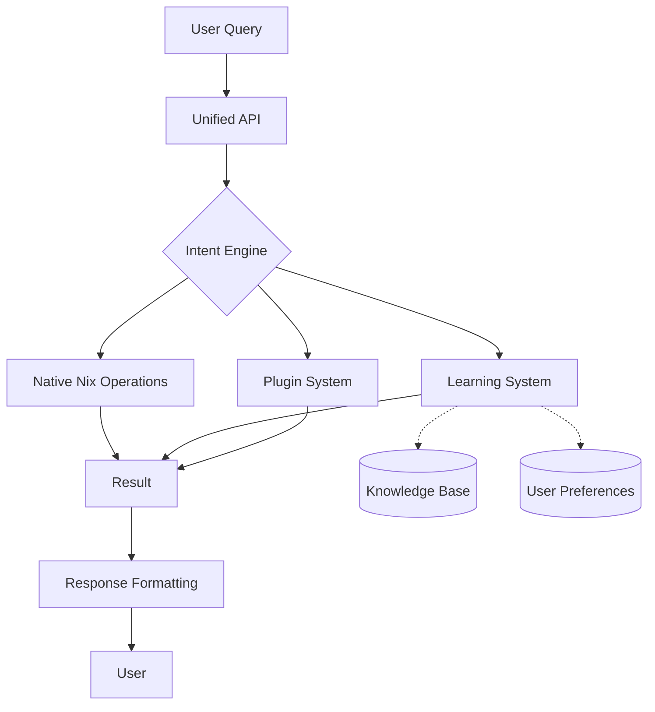

# Future-Proof Architecture for Nix for Humanity

## 🎯 Core Design Principles

### 1. **Headless Core, Multiple Frontends**
```
┌─────────────────────────────────────────────────┐
│                   FRONTENDS                      │
├──────────┬──────────┬──────────┬────────────────┤
│   CLI    │   TUI    │  Voice   │  Web/Desktop   │
└──────────┴──────────┴──────────┴────────────────┘
                      ↓
┌─────────────────────────────────────────────────┐
│              UNIFIED BACKEND API                 │
│         (Language-agnostic, versioned)           │
└─────────────────────────────────────────────────┘
                      ↓
┌─────────────────────────────────────────────────┐
│           NATIVE PYTHON-NIX CORE                 │
│    (Direct bindings, 10x-1500x performance)      │
└─────────────────────────────────────────────────┘
```

### 2. **Plugin Architecture**
```python
# Core provides extension points
class NixForHumanityCore:
    def __init__(self):
        self.plugins = PluginRegistry()
        self.hooks = HookSystem()

    def execute(self, intent: Intent) -> Result:
        # Pre-execution hooks
        intent = self.hooks.run("pre_execute", intent)

        # Core execution
        result = self._execute_native(intent)

        # Post-execution hooks
        result = self.hooks.run("post_execute", result)

        return result
```

### 3. **Versioned API Contracts**
```python
# API versioning for backward compatibility
@api_version("v1")
class NixAPIv1:
    def install(self, package: str) -> Result:
        return self._legacy_install(package)

@api_version("v2")
class NixAPIv2:
    def install(self, package: str, options: InstallOptions = None) -> Result:
        return self._modern_install(package, options)
```

## 🏗️ Layered Architecture

### Layer 1: Native Nix Operations (Foundation)
```python
# nix_for_humanity/core/native/
class NativeNixOperations:
    """Direct Python-Nix bindings - NO subprocess"""

    def build(self, derivation: str) -> StorePath:
        """Native build using nixos-rebuild-ng"""
        from nixos_rebuild import nix
        return nix.build(derivation)

    def query(self, expression: str) -> Any:
        """Direct Nix expression evaluation"""
        return nix.eval(expression)
```

### Layer 2: Intent & Knowledge Engine
```python
# nix_for_humanity/core/intelligence/
class IntentEngine:
    """Natural language understanding"""

    def __init__(self):
        self.nlp = ModularNLP()  # Pluggable NLP backend
        self.knowledge = KnowledgeGraph()  # Evolving knowledge

    async def understand(self, query: str) -> Intent:
        # Multiple understanding strategies
        candidates = await asyncio.gather(
            self.nlp.parse(query),
            self.knowledge.infer(query),
            self.context.apply(query)
        )
        return self.disambiguate(candidates)
```

### Layer 3: Execution & Orchestration
```python
# nix_for_humanity/core/execution/
class ExecutionEngine:
    """Orchestrates complex operations"""

    def __init__(self):
        self.native = NativeNixOperations()
        self.planner = ExecutionPlanner()
        self.monitor = ProgressMonitor()

    async def execute(self, intent: Intent) -> Result:
        # Plan execution strategy
        plan = self.planner.create_plan(intent)

        # Execute with monitoring
        async with self.monitor.track(plan):
            results = []
            for step in plan.steps:
                result = await self._execute_step(step)
                results.append(result)

                # Adaptive execution
                if result.requires_adaptation:
                    plan = self.planner.adapt(plan, result)

        return self.aggregate_results(results)
```

### Layer 4: Learning & Adaptation
```python
# nix_for_humanity/core/learning/
class AdaptiveLearning:
    """Learns from every interaction"""

    def __init__(self):
        self.patterns = PatternRecognizer()
        self.preferences = UserPreferences()
        self.feedback = FeedbackLoop()

    async def learn(self, interaction: Interaction):
        # Learn patterns
        pattern = self.patterns.extract(interaction)

        # Update preferences
        self.preferences.update(interaction.user, pattern)

        # Optimize future behavior
        if interaction.feedback:
            self.feedback.incorporate(interaction.feedback)
```

### Layer 5: API & Interfaces
```python
# nix_for_humanity/api/
class UnifiedAPI:
    """Single API for all frontends"""

    @endpoint("/execute", version="v1")
    async def execute(self, request: ExecuteRequest) -> ExecuteResponse:
        # Validate request
        request = self.validate(request)

        # Process through core
        intent = await self.engine.understand(request.query)
        result = await self.engine.execute(intent)

        # Format response for client
        return self.format_response(result, request.format)

    @endpoint("/stream", version="v2")
    async def stream_execute(self, request: StreamRequest):
        """Real-time streaming for long operations"""
        async for update in self.engine.execute_streaming(request):
            yield update
```

## 🔮 Future Features & Extensibility

### 1. **AI Model Abstraction**
```python
class ModelProvider(ABC):
    """Pluggable AI models"""

    @abstractmethod
    async def complete(self, prompt: str) -> str:
        pass

class LocalLLM(ModelProvider):
    """Ollama, llama.cpp, etc."""

class CloudLLM(ModelProvider):
    """OpenAI, Anthropic, etc."""

class HybridLLM(ModelProvider):
    """Best of both worlds"""
```

### 2. **Distributed Execution**
```python
class DistributedExecutor:
    """Execute across multiple machines"""

    async def execute_distributed(self, plan: ExecutionPlan):
        # Distribute work
        tasks = self.distribute(plan.steps)

        # Execute in parallel
        results = await asyncio.gather(*[
            self.execute_remote(task, node)
            for task, node in tasks
        ])

        return self.merge_results(results)
```

### 3. **Declarative Configuration Generation**
```python
class ConfigGenerator:
    """Natural language to Nix configurations"""

    def generate(self, description: str) -> NixConfig:
        # Parse requirements
        requirements = self.parse_requirements(description)

        # Generate config
        config = NixConfig()
        for req in requirements:
            module = self.module_library.find_best_match(req)
            config.add_module(module)

        # Optimize and validate
        config = self.optimizer.optimize(config)
        self.validator.validate(config)

        return config
```

### 4. **Time-Travel Debugging**
```python
class SystemTimeline:
    """Track and replay system states"""

    def checkpoint(self) -> Checkpoint:
        return Checkpoint(
            generation=self.get_current_generation(),
            packages=self.get_installed_packages(),
            config=self.get_configuration()
        )

    def restore(self, checkpoint: Checkpoint):
        """Restore to exact system state"""
        self.native.switch_to_generation(checkpoint.generation)
```

## 🚀 Migration Path

### Phase 1: Solid Foundation (Current)
```python
# What we have now
- Native Python-Nix API ✅
- Basic natural language parsing ✅
- Command execution ✅
```

### Phase 2: Unified Backend (Next)
```python
# Consolidate into headless core
class NixForHumanityBackend:
    def __init__(self):
        self.native = NativeNixOperations()
        self.intent = IntentEngine()
        self.executor = ExecutionEngine()

    async def process(self, query: str) -> Result:
        intent = await self.intent.understand(query)
        return await self.executor.execute(intent)
```

### Phase 3: Multiple Frontends
```python
# CLI frontend
class CLIFrontend:
    def __init__(self):
        self.backend = NixForHumanityBackend()

# TUI frontend
class TUIFrontend:
    def __init__(self):
        self.backend = NixForHumanityBackend()

# Voice frontend
class VoiceFrontend:
    def __init__(self):
        self.backend = NixForHumanityBackend()
```

### Phase 4: Advanced Features
- Plugin system
- Distributed execution
- AI model abstraction
- Advanced learning

## 📋 Implementation Strategy

### 1. **Start with Minimal Core**
```python
# nix_for_humanity/core/__init__.py
class NixForHumanity:
    """Minimal, extensible core"""

    def __init__(self):
        self.native = NativeAPI()
        self.plugins = []

    def execute(self, query: str) -> Result:
        # Simple, working implementation
        intent = self.parse(query)
        return self.native.execute(intent)

    def register_plugin(self, plugin: Plugin):
        # Extensibility from day one
        self.plugins.append(plugin)
```

### 2. **Version Everything**
```python
# API versioning
@version("1.0.0")
class APIv1:
    pass

# Config versioning
config = {
    "version": "1.0.0",
    "migration": "auto"
}

# Protocol versioning
class Protocol:
    VERSION = "1.0.0"
```

### 3. **Design for Testing**
```python
class TestableCore:
    def __init__(self, native=None):
        # Dependency injection
        self.native = native or NativeAPI()

    def execute(self, query: str, dry_run: bool = False):
        # Testability built in
        if dry_run:
            return self.simulate(query)
        return self.native.execute(query)
```

## 🎯 Key Decisions for Future-Proofing

### 1. **Data Format**: Use Protocol Buffers or MessagePack
- Binary efficiency
- Schema evolution
- Language agnostic

### 2. **Communication**: gRPC or WebSockets
- Streaming support
- Bidirectional communication
- Progress updates

### 3. **Storage**: SQLite + Optional PostgreSQL
- Start simple (SQLite)
- Scale when needed (PostgreSQL)
- Same query interface

### 4. **Configuration**: TOML/YAML with JSON Schema
- Human readable
- Machine validatable
- Version migrateable

### 5. **Packaging**: Nix Flakes from Day One
- Reproducible builds
- Easy deployment
- Cross-platform support

## 🌟 The Vision



## 💎 Core Promise

**"Write once, run everywhere, extend forever"**

- One backend, many frontends
- One API, many versions
- One core, many plugins
- One vision, endless possibilities

---

*This architecture ensures Nix for Humanity can evolve from a simple CLI to a comprehensive AI-powered NixOS assistant without breaking existing functionality.*
