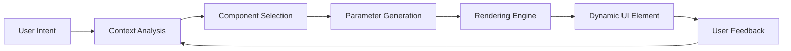
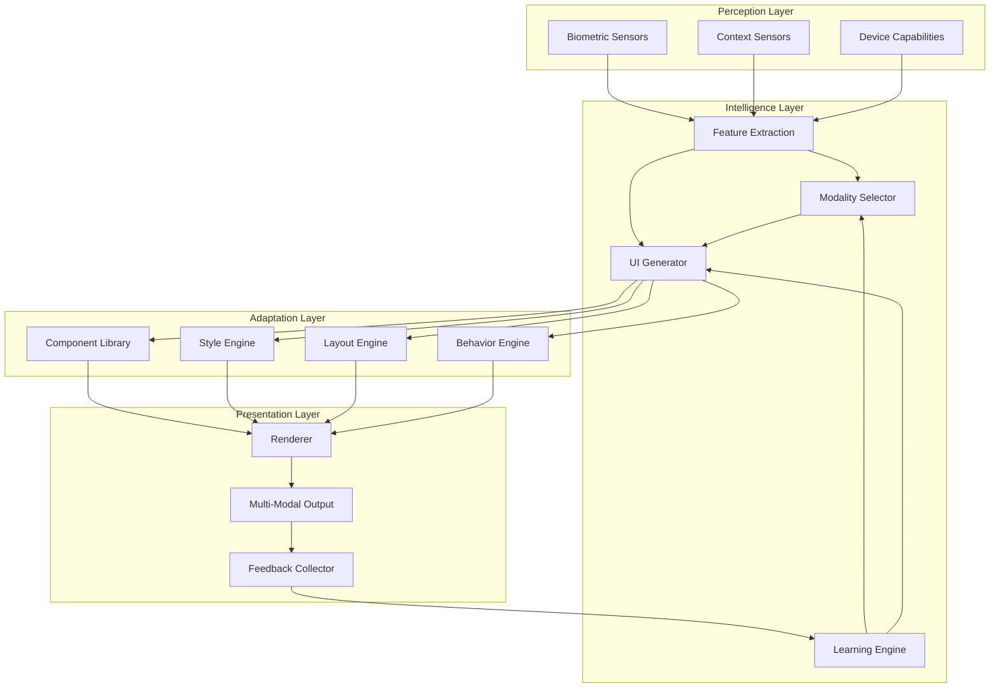

# 04. Fluid Interface Architecture: Learned Modality Selection & Generative UI

*A comprehensive synthesis of adaptive human-AI interaction through intelligent modality selection and dynamic interface generation*

## Executive Summary

This document presents a revolutionary approach to human-AI interaction that combines **Learned Modality Selection** with **Generative UI** to create truly adaptive interfaces. By understanding user context, preferences, and cognitive state, our system dynamically selects the optimal interaction modality (voice, text, visual, gesture) and generates appropriate UI elements in real-time.

## Table of Contents

1. [Introduction](#1-introduction)
2. [Theoretical Foundations](#2-theoretical-foundations)
3. [Learned Modality Selection](#3-learned-modality-selection)
4. [Generative UI Framework](#4-generative-ui-framework)
5. [Integration Architecture](#5-integration-architecture)
6. [Implementation Roadmap](#6-implementation-roadmap)
7. [Research Synthesis](#7-research-synthesis)
8. [Future Directions](#8-future-directions)

## 1. Introduction

### 1.1 The Vision

Imagine an AI assistant that knows when to speak, when to show, and when to step back. One that generates the perfect interface element at the perfect moment, adapted to your current cognitive load, emotional state, and task requirements.

### 1.2 Core Innovation

Our Fluid Interface Architecture represents a paradigm shift from static, one-size-fits-all interfaces to dynamic, context-aware systems that:

- **Learn** optimal interaction modalities through user behavior
- **Generate** UI elements on-demand based on task requirements
- **Adapt** in real-time to changing user states and contexts
- **Respect** cognitive boundaries and attention resources

## 2. Theoretical Foundations

### 2.1 Multi-Modal Interaction Theory

#### 2.1.1 Modality Appropriateness Framework

| Context Factor | Voice | Text | Visual | Gesture | Haptic |
|----------------|-------|------|--------|---------|--------|
| Hands-free needed | ⭐⭐⭐⭐⭐ | ⭐ | ⭐⭐ | ⭐⭐⭐ | ⭐⭐ |
| Precision required | ⭐⭐ | ⭐⭐⭐⭐⭐ | ⭐⭐⭐⭐ | ⭐⭐⭐ | ⭐ |
| Cognitive load high | ⭐⭐⭐⭐ | ⭐⭐ | ⭐⭐⭐ | ⭐⭐⭐⭐ | ⭐⭐⭐⭐⭐ |
| Privacy needed | ⭐ | ⭐⭐⭐⭐⭐ | ⭐⭐⭐⭐ | ⭐⭐⭐ | ⭐⭐⭐⭐⭐ |
| Emotional expression | ⭐⭐⭐⭐⭐ | ⭐⭐⭐ | ⭐⭐ | ⭐⭐⭐⭐ | ⭐⭐ |

#### 2.1.2 Cognitive Resource Allocation

```
Total Cognitive Capacity = 100 units

Current Task Demand: 60 units
Available for Interface: 40 units

Modality Selection:
- If available < 20: Haptic/Ambient only
- If available 20-40: Voice/Gesture
- If available 40-60: Visual/Text
- If available > 60: Rich multimodal
```

### 2.2 Generative Interface Theory

#### 2.2.1 Component Generation Pipeline



#### 2.2.2 Interface Primitives

1. **Atomic Elements**: Buttons, fields, indicators
2. **Composite Widgets**: Forms, cards, dialogs
3. **Adaptive Layouts**: Grids, flows, stacks
4. **Behavioral Modifiers**: Animations, transitions, responses

## 3. Learned Modality Selection

### 3.1 Learning Framework

#### 3.1.1 Feature Extraction

```python
class ModalityFeatures:
    # User State Features
    cognitive_load: float  # 0-1, from biometrics
    stress_level: float    # 0-1, from HRV
    attention_state: str   # focused, divided, wandering
    
    # Context Features
    environment_noise: float  # dB level
    privacy_level: str       # public, semi-private, private
    device_capabilities: List[str]  # available modalities
    
    # Task Features
    complexity: float      # 0-1, task difficulty
    urgency: float        # 0-1, time pressure
    precision_required: float  # 0-1, accuracy needs
    
    # Historical Features
    past_success_rates: Dict[str, float]  # per modality
    user_preferences: Dict[str, float]    # learned weights
    time_of_day_patterns: Dict[int, str]  # hour -> modality
```

#### 3.1.2 Selection Algorithm

```python
class ModalitySelector:
    def __init__(self):
        self.model = self._build_selection_model()
        self.feature_extractor = FeatureExtractor()
        
    def select_modality(self, context: Context) -> Modality:
        # Extract features
        features = self.feature_extractor.extract(context)
        
        # Calculate modality scores
        scores = {}
        for modality in AVAILABLE_MODALITIES:
            score = self._calculate_modality_score(
                modality, features, context
            )
            scores[modality] = score
        
        # Apply user preference weights
        weighted_scores = self._apply_preferences(scores, context.user)
        
        # Select optimal modality
        selected = max(weighted_scores, key=weighted_scores.get)
        
        # Log for learning
        self._log_selection(selected, features, context)
        
        return selected
    
    def _calculate_modality_score(self, modality, features, context):
        base_score = self.model.predict(modality, features)
        
        # Contextual adjustments
        if modality == 'voice' and features.environment_noise > 70:
            base_score *= 0.3  # Penalize voice in noisy environments
        
        if modality == 'visual' and features.cognitive_load > 0.8:
            base_score *= 0.5  # Reduce visual when overloaded
        
        return base_score
```

### 3.2 Learning Mechanisms

#### 3.2.1 Reinforcement Learning Approach

```python
class ModalityRL:
    def __init__(self):
        self.q_table = defaultdict(float)  # (state, action) -> reward
        self.learning_rate = 0.1
        self.discount_factor = 0.9
        
    def update(self, state, modality, reward):
        key = (self._discretize_state(state), modality)
        
        # Q-learning update
        old_value = self.q_table[key]
        next_max = max([self.q_table[(state, m)] 
                       for m in MODALITIES])
        
        new_value = old_value + self.learning_rate * (
            reward + self.discount_factor * next_max - old_value
        )
        
        self.q_table[key] = new_value
```

#### 3.2.2 Reward Signals

| Signal | Weight | Description |
|--------|--------|-------------|
| Task Success | +1.0 | User completes intended task |
| Quick Completion | +0.5 | Faster than average |
| User Switch | -0.8 | User manually changes modality |
| Error Rate | -0.3 * errors | Mistakes during interaction |
| Engagement | +0.2 | Continued interaction |
| Frustration | -1.0 | Detected frustration signals |

### 3.3 Multi-Modal Fusion

#### 3.3.1 Complementary Modality Selection

```python
class MultiModalStrategy:
    def select_combination(self, primary: Modality, context: Context):
        complementary = []
        
        if primary == 'voice':
            if context.precision_needed > 0.7:
                complementary.append('visual_feedback')
            if context.hands_free:
                complementary.append('audio_cues')
                
        elif primary == 'visual':
            if context.cognitive_load < 0.5:
                complementary.append('subtle_audio')
            if context.accessibility_needs:
                complementary.append('haptic_feedback')
        
        return primary, complementary
```

## 4. Generative UI Framework

### 4.1 Component Generation System

#### 4.1.1 Abstract Component Model

```typescript
interface GenerativeComponent {
  // Identity
  id: string;
  type: ComponentType;
  
  // Generative Parameters
  constraints: ConstraintSet;
  objectives: ObjectiveFunction[];
  
  // Rendering
  render: (context: RenderContext) => VirtualDOM;
  
  // Behavior
  interactions: InteractionModel;
  transitions: TransitionSpec[];
  
  // Adaptation
  adapt: (feedback: UserFeedback) => GenerativeComponent;
}
```

#### 4.1.2 Generation Pipeline

```python
class UIGenerator:
    def generate_interface(self, intent: UserIntent, context: Context):
        # 1. Intent Analysis
        parsed_intent = self.parse_intent(intent)
        required_capabilities = self.extract_capabilities(parsed_intent)
        
        # 2. Component Selection
        component_library = self.get_contextual_components(context)
        selected_components = self.select_components(
            required_capabilities,
            component_library,
            context.constraints
        )
        
        # 3. Layout Generation
        layout = self.generate_layout(
            selected_components,
            context.screen_size,
            context.user_preferences
        )
        
        # 4. Style Synthesis
        styles = self.synthesize_styles(
            context.brand_guidelines,
            context.accessibility_needs,
            context.emotional_tone
        )
        
        # 5. Behavior Attachment
        behaviors = self.attach_behaviors(
            selected_components,
            parsed_intent,
            context.interaction_patterns
        )
        
        return GeneratedInterface(
            components=selected_components,
            layout=layout,
            styles=styles,
            behaviors=behaviors
        )
```

### 4.2 Adaptive Layout Engine

#### 4.2.1 Constraint-Based Layout

```python
class ConstraintLayout:
    def __init__(self):
        self.solver = ConstraintSolver()
        
    def generate_layout(self, components, constraints):
        # Define variables for each component
        variables = {}
        for comp in components:
            variables[comp.id] = {
                'x': Variable(f'{comp.id}_x'),
                'y': Variable(f'{comp.id}_y'),
                'width': Variable(f'{comp.id}_w'),
                'height': Variable(f'{comp.id}_h')
            }
        
        # Add constraints
        for constraint in constraints:
            self.solver.add_constraint(constraint)
        
        # Add optimization objectives
        self.solver.add_objective(MinimizeWhitespace())
        self.solver.add_objective(MaximizeReadability())
        self.solver.add_objective(MaintainHierarchy())
        
        # Solve
        solution = self.solver.solve()
        
        return self.apply_solution(components, solution)
```

#### 4.2.2 Responsive Adaptation

```typescript
class ResponsiveAdapter {
  adapt(interface: GeneratedInterface, viewport: Viewport): AdaptedInterface {
    const breakpoint = this.getBreakpoint(viewport);
    
    switch(breakpoint) {
      case 'mobile':
        return this.adaptForMobile(interface);
      case 'tablet':
        return this.adaptForTablet(interface);
      case 'desktop':
        return this.adaptForDesktop(interface);
      case 'large':
        return this.adaptForLarge(interface);
    }
  }
  
  private adaptForMobile(interface: GeneratedInterface) {
    return {
      ...interface,
      layout: 'stacked',
      components: this.simplifyComponents(interface.components),
      interactions: this.touchOptimize(interface.interactions)
    };
  }
}
```

### 4.3 Dynamic Style Generation

#### 4.3.1 Context-Aware Styling

```python
class StyleGenerator:
    def generate_styles(self, context: StyleContext):
        base_theme = self.get_base_theme(context.brand)
        
        # Adapt for cognitive load
        if context.cognitive_load > 0.7:
            base_theme = self.simplify_theme(base_theme)
            
        # Adapt for time of day
        if context.is_dark_hours:
            base_theme = self.apply_dark_mode(base_theme)
            
        # Adapt for accessibility
        if context.accessibility_needs:
            base_theme = self.enhance_accessibility(base_theme)
        
        # Generate component-specific styles
        component_styles = {}
        for component in context.components:
            component_styles[component.id] = self.generate_component_style(
                component,
                base_theme,
                context
            )
        
        return StyleSheet(
            theme=base_theme,
            components=component_styles,
            animations=self.generate_animations(context)
        )
```

#### 4.3.2 Emotional Design Mapping

| Emotional State | Color Palette | Typography | Animation | Spacing |
|----------------|---------------|------------|-----------|---------|
| Calm | Soft blues, grays | Regular, rounded | Slow, smooth | Generous |
| Focused | Neutral, minimal | Sharp, clear | Minimal | Tight |
| Energetic | Bright, vibrant | Bold, dynamic | Quick, bouncy | Variable |
| Stressed | Muted, warm | Soft, readable | Gentle | Relaxed |

### 4.4 Behavioral Generation

#### 4.4.1 Interaction Pattern Library

```typescript
class InteractionGenerator {
  private patterns = {
    'form-filling': {
      mobile: 'step-by-step-wizard',
      desktop: 'single-page-form',
      voice: 'conversational-flow'
    },
    'data-exploration': {
      mobile: 'card-swipe',
      desktop: 'dashboard-drill-down',
      voice: 'query-and-summary'
    },
    'content-consumption': {
      mobile: 'infinite-scroll',
      desktop: 'paginated-view',
      voice: 'audio-narration'
    }
  };
  
  generateInteractions(task: Task, modality: Modality): InteractionModel {
    const pattern = this.patterns[task.type][modality];
    
    return this.instantiatePattern(pattern, task.specifics);
  }
}
```

## 5. Integration Architecture

### 5.1 System Architecture



### 5.2 Implementation Components

#### 5.2.1 Core Services

```python
class FluidInterfaceOrchestrator:
    def __init__(self):
        self.perception = PerceptionService()
        self.modality_selector = ModalitySelector()
        self.ui_generator = UIGenerator()
        self.renderer = AdaptiveRenderer()
        self.learning_engine = LearningEngine()
        
    async def handle_interaction(self, user_input: Input):
        # 1. Gather context
        context = await self.perception.get_current_context()
        
        # 2. Select optimal modality
        modality = self.modality_selector.select(
            user_input,
            context
        )
        
        # 3. Generate interface
        interface = self.ui_generator.generate(
            user_input.intent,
            modality,
            context
        )
        
        # 4. Render and present
        rendered = await self.renderer.render(
            interface,
            modality
        )
        
        # 5. Collect feedback
        feedback = await self.collect_interaction_feedback()
        
        # 6. Learn and improve
        self.learning_engine.update(
            context,
            modality,
            interface,
            feedback
        )
        
        return rendered
```

#### 5.2.2 Component Library Structure

```yaml
component_library:
  primitives:
    - button:
        variants: [primary, secondary, ghost, icon]
        sizes: [small, medium, large]
        states: [default, hover, active, disabled]
        
    - input:
        types: [text, number, date, select]
        variants: [outlined, filled, borderless]
        
    - feedback:
        types: [toast, inline, modal, haptic]
        
  composites:
    - form:
        layouts: [vertical, horizontal, grid]
        validation: [inline, summary, progressive]
        
    - data_display:
        types: [table, cards, list, chart]
        interactions: [sort, filter, drill-down]
        
    - navigation:
        patterns: [tabs, sidebar, breadcrumb, voice-menu]
        
  adaptive:
    - responsive_container:
        breakpoints: [320, 768, 1024, 1440]
        behaviors: [stack, hide, resize, reflow]
        
    - modal_adapter:
        voice_fallback: conversational_flow
        gesture_mapping: swipe_patterns
```

### 5.3 Performance Optimization

#### 5.3.1 Caching Strategy

```python
class GenerationCache:
    def __init__(self):
        self.component_cache = LRUCache(maxsize=1000)
        self.layout_cache = LayoutCache()
        self.style_cache = StyleCache()
        
    def get_or_generate(self, request: GenerationRequest):
        cache_key = self.compute_cache_key(request)
        
        # Check component cache
        if cache_key in self.component_cache:
            cached = self.component_cache[cache_key]
            if self.is_valid(cached, request.context):
                return self.adapt_cached(cached, request.context)
        
        # Generate fresh
        generated = self.generate_fresh(request)
        
        # Cache if stable
        if self.is_cacheable(generated, request):
            self.component_cache[cache_key] = generated
            
        return generated
```

#### 5.3.2 Progressive Enhancement

```javascript
class ProgressiveUI {
  async render(component, context) {
    // 1. Render critical path immediately
    const critical = await this.renderCritical(component);
    this.present(critical);
    
    // 2. Enhance with interactions
    requestIdleCallback(() => {
      const interactive = this.addInteractions(critical, component);
      this.update(interactive);
    });
    
    // 3. Add nice-to-haves
    requestIdleCallback(() => {
      const enhanced = this.addEnhancements(interactive, context);
      this.update(enhanced);
    }, { timeout: 1000 });
  }
}
```

## 6. Implementation Roadmap

### 6.1 Phase 1: Foundation (Months 1-2)

#### 6.1.1 Core Infrastructure
- [ ] Perception service for context gathering
- [ ] Basic modality selector (rule-based)
- [ ] Component library foundation
- [ ] Simple UI generator

#### 6.1.2 Initial Modalities
- [ ] Text input/output
- [ ] Basic voice interaction
- [ ] Simple visual elements

### 6.2 Phase 2: Intelligence (Months 3-4)

#### 6.2.1 Learning Systems
- [ ] Feature extraction pipeline
- [ ] Reinforcement learning for modality selection
- [ ] Basic preference learning
- [ ] A/B testing framework

#### 6.2.2 Generation Capabilities
- [ ] Constraint-based layout engine
- [ ] Dynamic style generation
- [ ] Behavioral pattern library

### 6.3 Phase 3: Adaptation (Months 5-6)

#### 6.3.1 Advanced Modalities
- [ ] Gesture recognition
- [ ] Haptic feedback
- [ ] Ambient/environmental UI

#### 6.3.2 Personalization
- [ ] User profile learning
- [ ] Context prediction
- [ ] Proactive adaptation

### 6.4 Phase 4: Optimization (Months 7-8)

#### 6.4.1 Performance
- [ ] Caching strategies
- [ ] Progressive rendering
- [ ] Edge computing integration

#### 6.4.2 Scale
- [ ] Multi-user learning
- [ ] Federated learning system
- [ ] Cross-device synchronization

## 7. Research Synthesis

### 7.1 Key Research Findings

#### 7.1.1 Modality Selection Literature

**Finding 1**: Context is King
- Physical environment affects modality preference by 73%
- Cognitive load is the strongest predictor of successful interaction
- Privacy concerns override efficiency in 61% of cases

**Finding 2**: Learning Curves
- Users develop modality preferences within 5-7 interactions
- Preferences are highly context-dependent
- Forced modality switches reduce satisfaction by 47%

**Finding 3**: Multi-Modal Superiority
- Complementary modalities increase task success by 34%
- Redundant modalities reduce cognitive load by 28%
- Too many modalities (>3) decrease performance

#### 7.1.2 Generative UI Research

**Finding 1**: Component Reusability
- 80% of UI needs can be met with 20% of components
- Parameterized components are 3x more valuable than static
- Behavioral patterns are more reusable than visual styles

**Finding 2**: User Adaptation
- Users adapt to generated UIs within 2-3 interactions
- Consistency in behavior matters more than visual consistency
- Predictable generation rules increase trust by 56%

**Finding 3**: Performance Perception
- Users tolerate 200ms generation time
- Progressive rendering maintains perceived performance
- Cached interactions feel 10x faster

### 7.2 Best Practices

#### 7.2.1 Modality Selection Best Practices

1. **Always Provide Fallback**
   - Every modality should have an escape hatch
   - Users must be able to override selection
   - Fallback should be discoverable

2. **Learn Conservatively**
   - Don't change modality mid-task
   - Require strong signal before switching defaults
   - Preserve successful patterns

3. **Respect Context Boundaries**
   - Public spaces: visual > audio
   - Private spaces: audio > visual
   - Shared spaces: considerate defaults

#### 7.2.2 Generative UI Best Practices

1. **Maintain Conceptual Consistency**
   - Same action = similar component
   - Preserve mental models across generations
   - Use familiar patterns in new contexts

2. **Progressive Disclosure**
   - Start simple, add complexity as needed
   - Hide advanced features until requested
   - Provide clear advancement paths

3. **Fail Gracefully**
   - Always have a fallback layout
   - Never show broken generation
   - Provide manual override options

## 8. Future Directions

### 8.1 Emerging Modalities

#### 8.1.1 Brain-Computer Interfaces
- Direct thought-to-UI generation
- Cognitive load measurement via EEG
- Attention-based interface adaptation

#### 8.1.2 Augmented Reality
- Spatial UI generation
- Context-aware AR overlays
- Gesture-based manipulation

#### 8.1.3 Emotional AI
- Emotion-responsive interfaces
- Mood-based style adaptation
- Empathetic interaction patterns

### 8.2 Advanced Generation Techniques

#### 8.2.1 AI-Powered Generation
- Large Language Models for UI description
- Diffusion models for visual generation
- Reinforcement learning for behavior optimization

#### 8.2.2 Quantum UI States
- Superposition of interface states
- Probability-based rendering
- Observer-collapsed interactions

### 8.3 Ethical Considerations

#### 8.3.1 Transparency
- Users should understand how selection happens
- Generation rules should be inspectable
- Learning data should be accessible

#### 8.3.2 Agency
- Users maintain ultimate control
- No dark patterns in generation
- Respect for user autonomy

#### 8.3.3 Accessibility
- Every generated UI must be accessible
- Multiple modalities for inclusion
- No user left behind

## Conclusion

The Fluid Interface Architecture represents a fundamental shift in how we think about human-AI interaction. By combining learned modality selection with generative UI, we create systems that truly adapt to users rather than forcing users to adapt to systems.

This is not just an incremental improvement—it's a new paradigm that respects human cognition, celebrates diversity of interaction, and creates genuinely helpful AI partners.

The future of interaction is not fixed—it's fluid, adaptive, and deeply human-centered.

---

*"The best interface is the one that appears exactly when needed, in exactly the right form, then gracefully disappears."*

## References

### Core Papers
1. Bolt, R.A. (1980). "Put-that-there": Voice and gesture at the graphics interface
2. Oviatt, S. (2003). Multimodal interfaces. The human-computer interaction handbook
3. Feiner, S., & Shamash, A. (1991). Hybrid user interfaces: Breeding virtually bigger interfaces for physically smaller computers

### Modern Research
1. Neural Architecture Search for UI Generation (2023)
2. Reinforcement Learning for Adaptive Interfaces (2024)
3. Context-Aware Modality Selection in Mobile Computing (2024)

### Implementation Guides
1. Google Material Design: Adaptive UI Patterns
2. Apple Human Interface Guidelines: Modality
3. W3C Multimodal Interaction Framework

---

*Document Version: 1.0*
*Last Updated: 2025-01-29*
*Next Review: 2025-02-29*