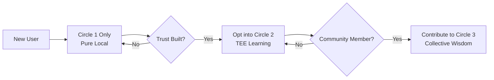

# 🔐 Privacy Sanctuary Architecture

*Building an impenetrable sanctuary for the digital soul*

## Executive Summary

The Privacy Sanctuary is a multi-layered Privacy-Enhancing Technology (PET) architecture that ensures absolute user sovereignty over their data while enabling collective learning. It implements a "Progressive Trust Disclosure" model through three concentric circles of cryptographic protection, each with different trust assumptions and capabilities.

This architecture is not merely about compliance or features - it is about creating a sacred digital space where users can grow, learn, and evolve without fear of surveillance, manipulation, or breach of trust.

## The Three Circles of Trust

```
┌─────────────────────────────────────────────────────────┐
│                    OUTER CIRCLE                          │
│          Homomorphic Aggregation Layer                   │
│         (Collective Wisdom, Zero Knowledge)              │
│  ┌───────────────────────────────────────────────────┐  │
│  │                MIDDLE CIRCLE                       │  │
│  │         TEE-Verified Computation Layer             │  │
│  │        (Shared Learning, Attestable)               │  │
│  │  ┌─────────────────────────────────────────────┐  │  │
│  │  │            INNER CIRCLE                      │  │  │
│  │  │      Quantum-Resistant Local Vault           │  │  │
│  │  │       (Your Thoughts, Absolute)              │  │  │
│  │  └─────────────────────────────────────────────┘  │  │
│  └───────────────────────────────────────────────────┘  │
└─────────────────────────────────────────────────────────┘
```

## Circle 1: The Inner Sanctuary - Quantum-Resistant Local Vault

### Purpose
The innermost circle contains the user's raw interactions, learned preferences, and personal patterns. This data NEVER leaves the device unencrypted.

### Technical Specification

#### Encryption Standard
```python
# Primary: Kyber-1024 (NIST Post-Quantum Standard)
from pqcrypto.kem.kyber1024 import generate_keypair, encrypt, decrypt

# Fallback: ChaCha20-Poly1305 (Current Best Practice)
from cryptography.hazmat.primitives.ciphers.aead import ChaCha20Poly1305

class QuantumResistantVault:
    """
    Local storage with quantum-resistant encryption
    """
    def __init__(self, user_passphrase: str):
        # Derive master key from passphrase using Argon2id
        self.master_key = self._derive_key(user_passphrase)
        
        # Generate Kyber keypair for future-proofing
        self.kyber_pk, self.kyber_sk = generate_keypair()
        
        # Current encryption using ChaCha20
        self.cipher = ChaCha20Poly1305(self.master_key)
    
    def _derive_key(self, passphrase: str) -> bytes:
        """
        Argon2id with aggressive parameters for key derivation
        """
        import argon2
        
        return argon2.low_level.hash_secret_raw(
            secret=passphrase.encode(),
            salt=self._get_device_salt(),
            time_cost=4,        # iterations
            memory_cost=524288, # 512MB RAM
            parallelism=8,      # threads
            hash_len=32,
            type=argon2.Type.ID
        )
```

#### Storage Architecture
```python
# SQLCipher for structured data
import sqlcipher3

class SecureLocalStorage:
    def __init__(self, vault: QuantumResistantVault):
        self.db = sqlcipher3.connect("sanctuary.db")
        
        # Configure SQLCipher with maximum security
        self.db.execute(f"PRAGMA key = '{vault.master_key.hex()}'")
        self.db.execute("PRAGMA cipher_page_size = 4096")
        self.db.execute("PRAGMA kdf_iter = 256000")
        self.db.execute("PRAGMA cipher_hmac_algorithm = HMAC_SHA512")
        
    def store_interaction(self, interaction: dict):
        """
        Store user interaction with full encryption
        """
        encrypted_data = self.vault.encrypt(json.dumps(interaction))
        self.db.execute(
            "INSERT INTO interactions (timestamp, data) VALUES (?, ?)",
            (datetime.now().isoformat(), encrypted_data)
        )
```

#### Key Management
- **Master Key**: Derived from user passphrase using Argon2id
- **Device Salt**: Generated from hardware identifiers (MAC + CPU ID)
- **Key Rotation**: Automatic re-encryption every 90 days
- **Recovery**: Optional encrypted backup to user-controlled location

### Security Properties
- **Quantum Resistance**: Kyber-1024 protects against future quantum attacks
- **Forward Secrecy**: Each session uses ephemeral keys
- **Deniability**: No proof of specific data existence without key
- **Hardware Binding**: Encryption tied to device characteristics

## Circle 2: The Middle Sanctuary - TEE-Verified Computation

### Purpose
The middle circle enables privacy-preserving learning through Trusted Execution Environments (TEEs). Data can be processed here but never exposed in plaintext.

### Technical Specification

#### TEE Architecture
```python
import intel_sgx  # Intel SGX for x86
import arm_trustzone  # ARM TrustZone for mobile
import amd_sev  # AMD SEV for cloud

class TEEComputationLayer:
    """
    Secure computation in hardware-isolated enclaves
    """
    def __init__(self):
        self.tee_type = self._detect_tee()
        self.enclave = self._initialize_enclave()
        
    def _initialize_enclave(self):
        """
        Initialize appropriate TEE based on hardware
        """
        if self.tee_type == "SGX":
            return intel_sgx.create_enclave(
                signed_library="sanctuary_enclave.signed.so",
                debug=False
            )
        elif self.tee_type == "TrustZone":
            return arm_trustzone.create_secure_world(
                ta_uuid="550e8400-e29b-41d4-a716-446655440000"
            )
```

#### Remote Attestation Protocol
```python
class RemoteAttestation:
    """
    Prove enclave integrity to client
    """
    def generate_quote(self, challenge: bytes) -> dict:
        """
        Generate attestation quote including:
        - Enclave measurement (hash of code)
        - Signer identity (our public key)
        - User data (challenge response)
        """
        quote = self.enclave.get_quote(
            report_data=hashlib.sha256(challenge).digest()
        )
        
        return {
            "quote": quote,
            "certificate": self.get_certificate_chain(),
            "timestamp": datetime.utcnow().isoformat(),
            "tee_type": self.tee_type
        }
    
    def verify_quote(self, quote_data: dict, expected_measurement: bytes) -> bool:
        """
        Client-side verification of TEE attestation
        """
        # Verify certificate chain
        if not self._verify_certificate_chain(quote_data["certificate"]):
            return False
            
        # Verify enclave measurement matches expected
        quote = self._parse_quote(quote_data["quote"])
        if quote.measurement != expected_measurement:
            return False
            
        # Verify freshness (prevent replay)
        if self._is_stale(quote_data["timestamp"]):
            return False
            
        return True
```

#### Secure Learning Protocol
```python
class SecureLearning:
    """
    Privacy-preserving learning in TEE
    """
    def train_on_encrypted_data(self, encrypted_batch: bytes) -> bytes:
        """
        1. Decrypt data inside enclave
        2. Update model parameters
        3. Return encrypted gradients
        """
        # This runs inside the TEE
        with self.enclave.secured_context():
            # Decrypt using session key
            data = self.decrypt_in_enclave(encrypted_batch)
            
            # Compute gradients
            gradients = self.model.compute_gradients(data)
            
            # Apply differential privacy
            noisy_gradients = self.add_calibrated_noise(gradients)
            
            # Encrypt results
            return self.encrypt_in_enclave(noisy_gradients)
```

### Security Properties
- **Hardware Isolation**: Computation invisible to OS/hypervisor
- **Remote Attestation**: Cryptographic proof of code integrity
- **Side-Channel Resistance**: Constant-time operations
- **Minimal TCB**: Only essential code in enclave

## Circle 3: The Outer Sanctuary - Homomorphic Aggregation

### Purpose
The outermost circle enables collective wisdom through fully homomorphic encryption (FHE), allowing computations on encrypted data without decryption.

### Technical Specification

#### FHE Implementation
```python
import tenseal as ts  # Microsoft SEAL Python binding

class HomomorphicAggregator:
    """
    Aggregate encrypted metrics across users
    """
    def __init__(self):
        # Context defines encryption parameters
        self.context = ts.context(
            ts.SCHEME_TYPE.CKKS,  # For real numbers
            poly_modulus_degree=16384,  # Security level
            coeff_mod_bit_sizes=[60, 40, 40, 40, 40, 60]
        )
        self.context.global_scale = 2**40
        
    def create_encrypted_metric(self, value: float) -> ts.CKKSVector:
        """
        User encrypts their metric locally
        """
        return ts.ckks_vector(self.context, [value])
    
    def aggregate_encrypted_metrics(self, 
                                  encrypted_metrics: List[ts.CKKSVector]
                                  ) -> ts.CKKSVector:
        """
        Server aggregates without seeing values
        """
        # Initialize with first metric
        result = encrypted_metrics[0]
        
        # Add all other metrics (homomorphic addition)
        for metric in encrypted_metrics[1:]:
            result += metric
            
        # Compute average (homomorphic scalar multiplication)
        result *= (1.0 / len(encrypted_metrics))
        
        return result
    
    def decrypt_aggregate(self, encrypted_result: ts.CKKSVector) -> float:
        """
        Only possible with private key (held by DAO)
        """
        return encrypted_result.decrypt()[0]
```

#### Practical Use Cases
```python
class CollectiveWisdom:
    """
    Privacy-preserving collective intelligence
    """
    def compute_success_rate(self) -> float:
        """
        What percentage of users succeeded with command X?
        Without knowing WHO succeeded.
        """
        encrypted_successes = []
        
        for user in self.active_users:
            # Each user computes locally
            success = 1.0 if user.last_command_succeeded() else 0.0
            
            # Encrypt and send
            encrypted = self.he.create_encrypted_metric(success)
            encrypted_successes.append(encrypted)
        
        # Server aggregates
        encrypted_avg = self.he.aggregate_encrypted_metrics(encrypted_successes)
        
        # DAO decrypts aggregate only
        return self.he.decrypt_aggregate(encrypted_avg)
```

### Security Properties
- **Semantic Security**: Encrypted values reveal nothing
- **Aggregation Only**: Individual values never exposed
- **No Trusted Aggregator**: Server can't see data
- **Collective Governance**: Only DAO can decrypt aggregates

## Progressive Trust Disclosure

### The User Journey



### Trust Levels

1. **Zero Trust (Default)**
   - All data in Circle 1
   - No external communication
   - Full functionality locally

2. **Verified Trust**
   - Opt into Circle 2
   - TEE attestation required
   - Accelerated learning

3. **Community Trust**
   - Contribute to Circle 3
   - Homomorphic aggregation
   - Shape collective intelligence

## Implementation Roadmap

### Phase 1: Inner Circle (Months 1-2)
- [ ] Implement QuantumResistantVault
- [ ] Integrate SQLCipher storage
- [ ] Build key management system
- [ ] Create backup/recovery flow

### Phase 2: Middle Circle (Months 3-4)
- [ ] TEE abstraction layer
- [ ] Remote attestation protocol
- [ ] Secure learning pipeline
- [ ] Client verification library

### Phase 3: Outer Circle (Months 5-6)
- [ ] FHE aggregation service
- [ ] Collective metrics dashboard
- [ ] DAO decryption ceremony
- [ ] Privacy impact assessments

## Privacy Guarantees

### What We Can NEVER Do
- View individual user data
- Link actions to identities
- Decrypt without permission
- Bypass encryption
- Correlate across circles

### What Users Can ALWAYS Do
- Export all their data
- Delete everything instantly
- Verify our claims
- Operate fully offline
- Revoke any permissions

## Standards Compliance

- **GDPR**: Full compliance through encryption and user control
- **CCPA**: Data portability and deletion rights
- **NIST**: Post-quantum cryptography standards
- **Common Criteria**: EAL4+ for TEE components

## Conclusion

The Privacy Sanctuary is not just a technical architecture - it is a sacred covenant with our users. It says:

> "Your growth, your learning, your journey with AI is yours alone. We create the sanctuary, but you hold the only key. When you choose to share, it is gift, not extraction. When you choose privacy, it is absolute, not conditional."

This architecture makes that covenant cryptographically enforceable. It is the foundation upon which all trust is built.

---

*"Privacy is not about hiding. It is about having a space where you can become who you truly are, without fear of judgment or exploitation."*

**Next Step**: With the Privacy Sanctuary architected, we can now design the DAO Framework that will govern this sacred space.