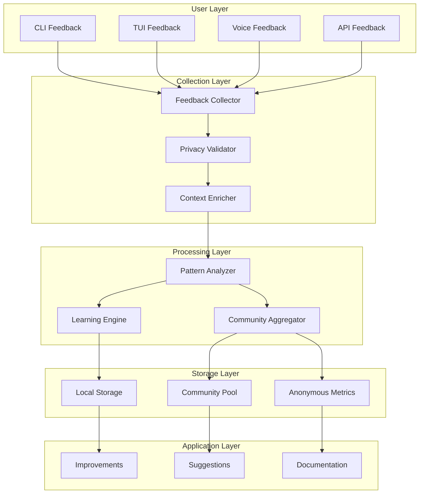
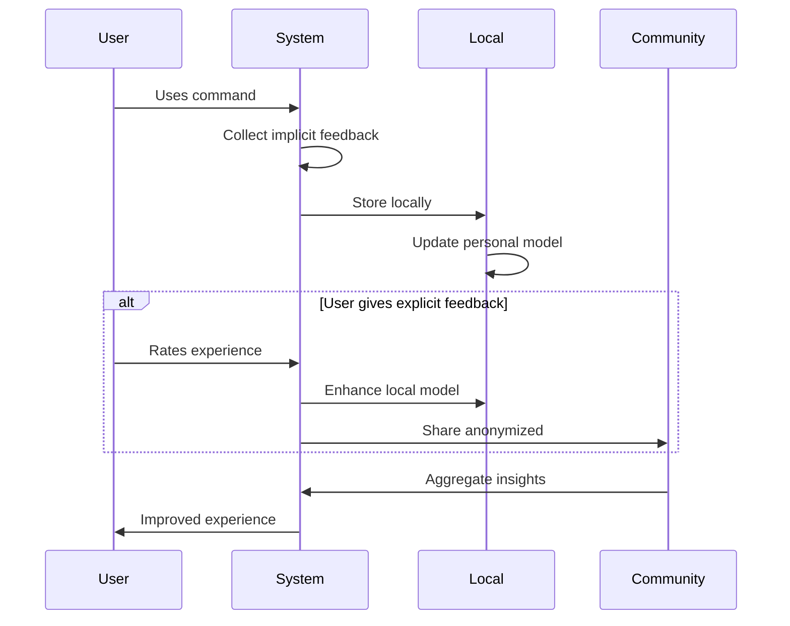
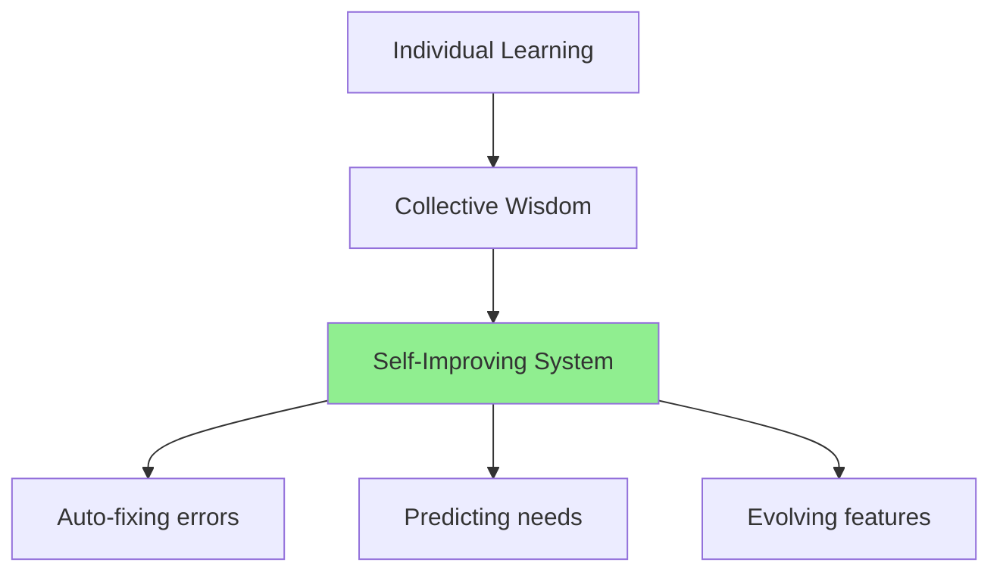

# 🔄 Feedback System Architecture - Nix for Humanity

## 🎯 Overview

A consciousness-first feedback system that learns from users while respecting privacy and building community wisdom.

## 🏗️ System Architecture



## 📊 Feedback Types

### 1. Implicit Feedback (Automatic)
```python
class ImplicitFeedback:
    """Collected automatically, privacy-preserving."""
    
    command_success: bool      # Did command work?
    response_time: float       # How fast?
    retry_count: int          # How many attempts?
    error_recovery: bool      # Did error help work?
    feature_discovery: List   # What features used?
```

### 2. Explicit Feedback (User-Initiated)
```python
class ExplicitFeedback:
    """User voluntarily provides."""
    
    satisfaction: int         # 1-5 scale
    suggestion: str          # Free text
    would_recommend: bool    # NPS score
    persona_fit: str        # Which persona helped?
```

### 3. Contextual Feedback (Smart)
```python
class ContextualFeedback:
    """System requests at right moment."""
    
    after_error: str         # "Did this help?"
    after_success: str       # "Was this what you wanted?"
    after_learning: str      # "Should I remember this?"
    after_complex: str       # "Was this too complicated?"
```

## 🔐 Privacy-First Design

### Local Learning
```yaml
What Stays Local:
  - Personal command history
  - Custom aliases
  - Failure patterns
  - Learning preferences
  - Time-of-day usage

Never Shared:
  - Identifiable information
  - File paths
  - System details
  - Network info
  - Personal data
```

### Anonymous Aggregation
```yaml
What Can Be Shared (Opt-in):
  - Command categories (not specifics)
  - Success/failure rates
  - Performance metrics
  - Feature usage stats
  - Error frequency

How It's Anonymized:
  - No timestamps
  - No sequences
  - No locations
  - Differential privacy
  - K-anonymity (k>5)
```

## 💡 Feedback UX Patterns

### CLI Feedback
```bash
$ ask-nix "install firefox"
✅ Firefox installed successfully!

How was this experience? (1-5 or skip): 5
💚 Thanks! Your feedback helps others.

# Only asks occasionally, not annoying
```

### TUI Feedback Widget
```
┌─ Feedback ────────────────────┐
│ 😊 How are we doing?          │
│                               │
│ [😡] [😕] [😐] [🙂] [😍]      │
│                               │
│ [Send] [Not now] [Never ask]  │
└───────────────────────────────┘
```

### Voice Feedback
```
System: "Installation complete. Say 'feedback' to rate."
User: "Feedback"
System: "On a scale of 1-5, how was that?"
User: "Four"
System: "Thanks! Any specific feedback?"
User: "The error message really helped"
System: "Noted. Thank you for helping improve Nix for Humanity!"
```

## 🧠 Learning Pipeline



## 📈 Feedback Analytics

### Personal Dashboard
```python
def show_personal_insights():
    """Show user their own patterns."""
    return {
        "favorite_commands": ["install", "search", "update"],
        "success_rate": "94%",
        "time_saved": "2.5 hours this month",
        "skills_learned": ["flakes", "home-manager"],
        "next_suggestion": "Try configuration generation!"
    }
```

### Community Insights
```python
def show_community_trends():
    """Aggregated, anonymous trends."""
    return {
        "popular_this_week": ["rust", "neovim", "docker"],
        "common_errors": {
            "typo": "firefox vs fierrfox (18%)",
            "case": "NodeJS vs nodejs (12%)"
        },
        "success_stories": 1247,
        "helpful_features": ["error education", "search"]
    }
```

## 🎯 Feedback-Driven Features

### Auto-Improvement Cycle
```yaml
Feedback Loop:
  1. Collect: User struggles with package name
  2. Analyze: 30% of users make same mistake  
  3. Improve: Add autocorrection
  4. Validate: Success rate improves to 95%
  5. Document: Add to FAQ
```

### Feature Prioritization
```python
def prioritize_features(feedback_data):
    """Use feedback to guide development."""
    return sorted(features, key=lambda f: (
        f.user_requests * 0.4 +
        f.error_reduction * 0.3 +
        f.time_saved * 0.2 +
        f.accessibility * 0.1
    ))
```

## 🔄 Implementation Details

### Feedback Collection Service
```python
class FeedbackCollector:
    def __init__(self):
        self.local_store = LocalFeedbackStore()
        self.privacy_guard = PrivacyValidator()
        self.rate_limiter = RateLimiter(max_per_hour=3)
    
    async def collect(self, feedback: Feedback):
        """Collect feedback with privacy and respect."""
        if not self.rate_limiter.should_ask():
            return  # Don't annoy users
        
        validated = self.privacy_guard.clean(feedback)
        await self.local_store.save(validated)
        
        if feedback.share_anonymous:
            await self.share_with_community(validated)
```

### Smart Timing
```python
def should_request_feedback(context):
    """Request feedback at meaningful moments."""
    
    # Good times to ask
    if context.just_succeeded_after_struggle:
        return True
    if context.discovered_new_feature:
        return True  
    if context.had_great_error_recovery:
        return True
        
    # Bad times to ask
    if context.user_frustrated:
        return False
    if context.asked_recently:
        return False
    if context.in_flow_state:
        return False
```

## 🌟 Feedback Rewards

### Personal Growth
```
Your Impact This Month:
- Helped improve 3 error messages
- Your suggestion implemented!
- Made NixOS easier for 500+ users
```

### Community Recognition
```
🏆 Feedback Champions:
- Most helpful suggestion
- Bug catcher award
- Documentation improver
- Accessibility advocate
```

## 🚀 Quick Implementation

### Phase 1: Basic Collection (Week 1)
- Simple satisfaction rating
- Success/failure tracking
- Local storage only

### Phase 2: Smart Feedback (Week 2)
- Contextual requests
- Pattern analysis
- Anonymous sharing opt-in

### Phase 3: Community Features (Week 3)
- Aggregated insights
- Trend detection
- Feature voting

### Phase 4: Advanced Learning (Week 4)
- Predictive improvements
- Personalized adaptations
- Community wisdom sharing

## 📋 Privacy Checklist

- [ ] All data encrypted at rest
- [ ] No PII in feedback
- [ ] Clear opt-in/opt-out
- [ ] Data retention limits
- [ ] Export user's own data
- [ ] Delete on request
- [ ] Anonymous by default
- [ ] Transparent about usage

## 🔮 Future Vision



---

*"Every piece of feedback is a gift that makes NixOS more accessible for the next person."*

**Privacy Promise**: Your data stays yours. Community benefits from patterns, not particulars.

**Sacred Principle**: Feedback serves consciousness - improving clarity, reducing confusion, increasing flow.