# 🏗️ Nix for Humanity - Visual Architecture Guide

## 🌟 System Overview

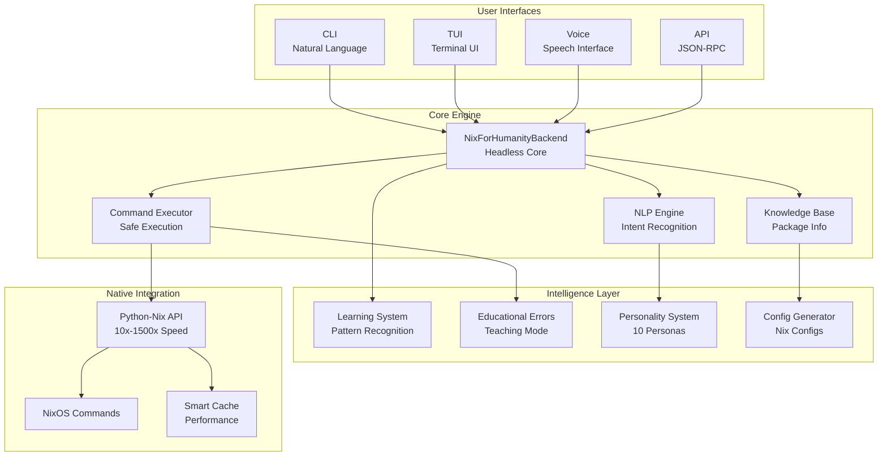

## 🚀 Performance Architecture

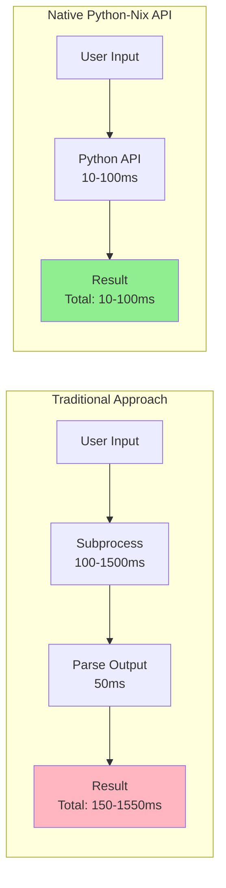

## 🧠 Learning System Flow

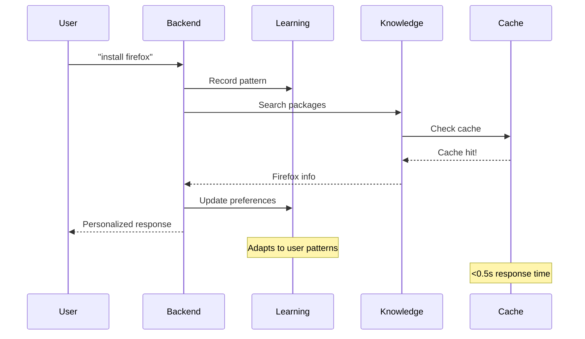

## 🎭 10 Personas System

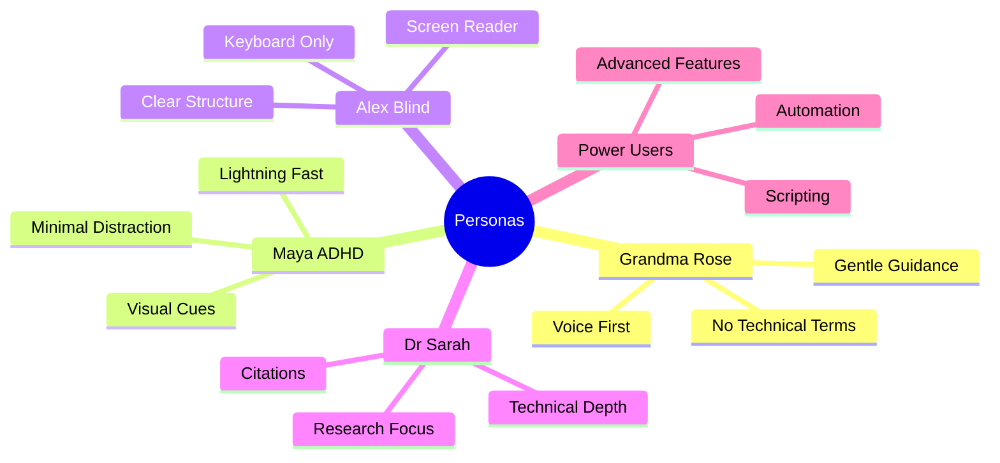

## 🔄 Request Processing Pipeline

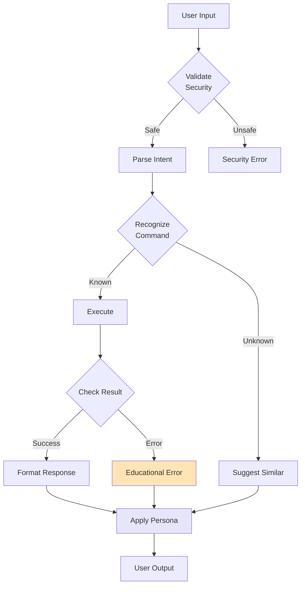

## 💎 Consciousness-First Design

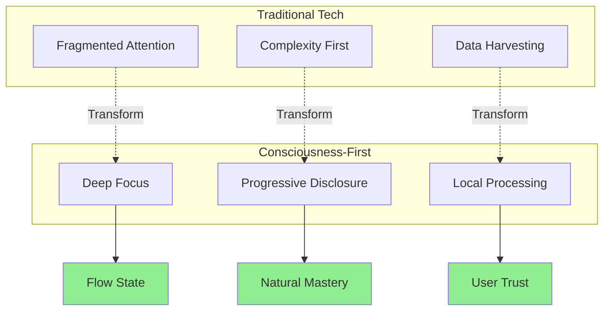

## 🏃 Performance Breakthrough

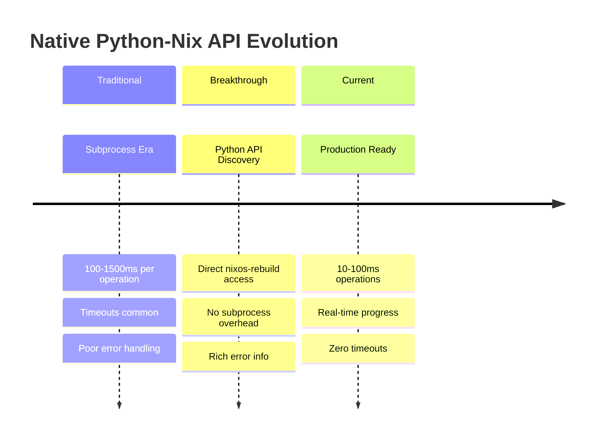

## 🔐 Security Architecture

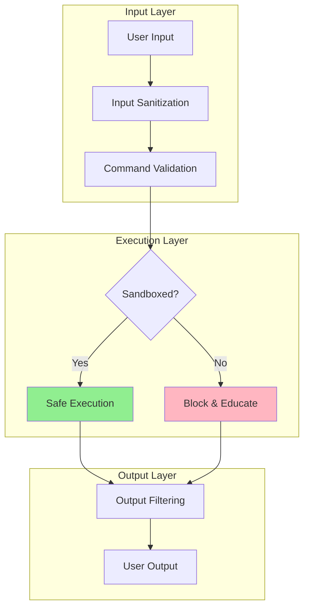

## 📊 Component Dependencies

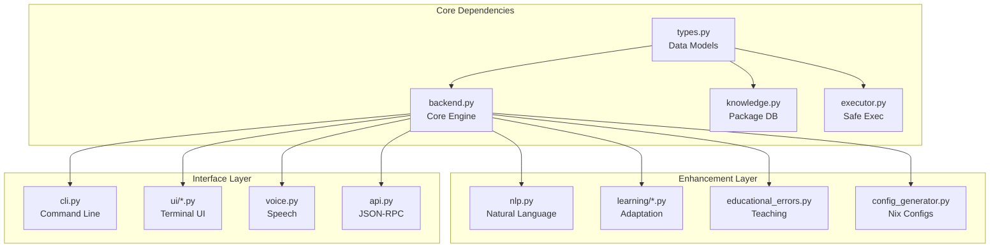

## 🌊 Sacred Trinity Development Flow

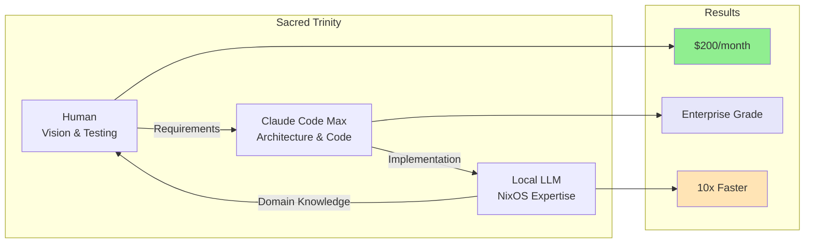

## 🎯 Usage Patterns

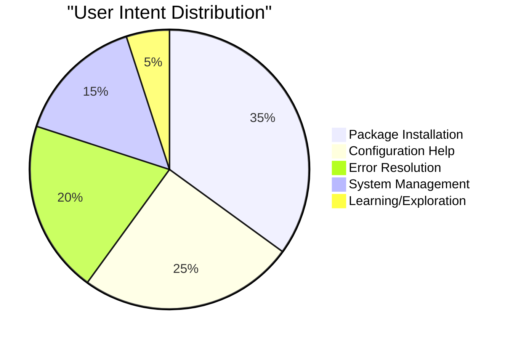

## 📈 Performance Metrics

```mermaid
xychart-beta
    title "Response Time Comparison (ms)"
    x-axis [Search, Install, Configure, Query, Generate]
    y-axis "Time (ms)" 0 --> 1600
    bar [100, 150, 200, 50, 300]
    bar [1000, 1500, 1200, 500, 1000]
    line [100, 150, 200, 50, 300]
```

Legend:
- Blue bars: Native Python-Nix API
- Orange bars: Traditional Subprocess
- Line: Performance target (<500ms)

---

## 🔗 Interactive Architecture Explorer

For an interactive exploration of the architecture:

1. **Component Deep Dive**: Each box in the diagrams links to detailed documentation
2. **Live Performance Metrics**: Real-time dashboard at `/metrics/dashboard.html`
3. **Video Walkthrough**: Architecture explanation video (coming soon)

## 🎬 Video Demonstrations

### 1. System Overview (5 min)
- High-level architecture walkthrough
- Component interactions
- Data flow visualization

### 2. Performance Deep Dive (3 min)
- Native Python-Nix API benefits
- Benchmark comparisons
- Real-world examples

### 3. User Experience Flow (4 min)
- Natural language processing
- Educational error handling
- Persona adaptation

---

*These diagrams are generated using Mermaid and can be rendered in any Markdown viewer that supports Mermaid syntax.*