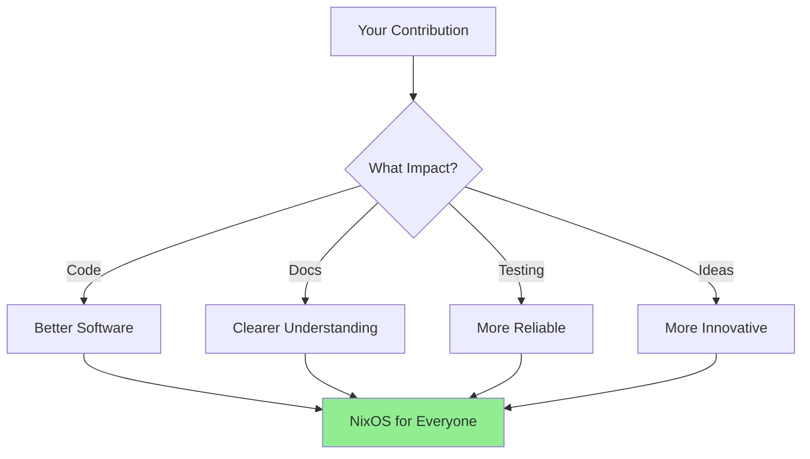

# 🤝 Community Contribution Guide - Nix for Humanity

## 🌟 Welcome Contributors!

Whether you're fixing a typo or implementing a new feature, every contribution makes NixOS more accessible to someone. This guide will help you contribute effectively while maintaining our consciousness-first principles.

## 🎯 Contribution Philosophy



## 🚀 Quick Start for New Contributors

### 1. Find Your First Issue
```bash
# Good first issues are labeled for you!
🏷️ good-first-issue - Perfect for beginners
🏷️ help-wanted - We need your expertise
🏷️ documentation - Great for non-coders
🏷️ accessibility - Help make it inclusive
```

### 2. Set Up Development Environment
```bash
# Clone the repository
git clone https://github.com/Luminous-Dynamics/nix-for-humanity.git
cd nix-for-humanity

# Enter development shell (all tools included!)
nix develop

# Run tests to verify setup
pytest tests/unit/test_core_engine.py

# You're ready to contribute! 🎉
```

### 3. Make Your First Contribution
```bash
# Create a branch
git checkout -b fix/improve-error-message

# Make your changes
$EDITOR src/nix_humanity/core/educational_errors.py

# Test your changes
pytest tests/unit/test_educational_errors.py

# Commit with our style
git commit -m "fix: improve error message for package not found

Makes the error message more educational by suggesting
search commands and similar package names.

Co-Authored-By: Your Name <your.email@example.com>"
```

## 📊 Contribution Types & Impact

### Code Contributions 💻

**Backend Improvements**
- Performance optimizations (<0.5s target)
- New NixOS command support
- Better error handling
- Security enhancements

**Frontend Features**
- TUI components
- CLI improvements
- Voice interface
- Accessibility features

**Example PR**: Adding Package Suggestions
```python
def suggest_similar_packages(typo: str) -> List[str]:
    """Educational feature: suggest corrections for typos."""
    # Your implementation here
    return similar_packages
```

### Documentation 📚

**User-Facing Docs**
- Tutorials for beginners
- How-to guides
- Video scripts
- FAQ updates

**Technical Docs**
- Architecture explanations
- API documentation
- Code comments
- Test documentation

**Example**: Improving Error Docs
```markdown
## Common Error: Package Not Found

**What you see:**
`error: attribute 'postgresql' missing`

**What it means:**
The package name might be incorrect.

**How to fix:**
1. Search for the correct name: `ask-nix search postgres`
2. Use the exact name: `ask-nix install postgresql_15`
```

### Testing 🧪

**Test Coverage Goals**
- Unit tests: 95%+ coverage
- Integration tests: Critical paths
- Performance tests: <0.5s operations
- Accessibility tests: All personas

**Example Test**:
```python
def test_educational_error_for_typo():
    """Errors should teach, not frustrate."""
    error = translate_error("attribute 'firefox' missing")
    assert "Did you mean" in error.message
    assert len(error.suggestions) > 0
    assert error.is_educational == True
```

### Community Building 🌍

**Ways to Help**
- Answer questions in discussions
- Review pull requests
- Share your NixOS journey
- Create tutorial content
- Translate documentation

## 🎨 Contribution Standards

### Code Style
```python
# Consciousness-first: Clear intent over clever code
def install_package(name: str) -> Result:
    """Install a package with educational feedback.
    
    Every function should:
    1. Have a clear, single purpose
    2. Include helpful error messages
    3. Maintain <0.5s performance
    4. Be accessible to all users
    """
    # Implementation
```

### Commit Messages
```bash
# Format: type: description
feat: add voice control for package installation
fix: correct typo detection in package names
docs: add guide for Python developers
test: increase coverage for error handling
perf: optimize package search to 0.3s
```

### Pull Request Template
```markdown
## Description
Brief description of changes

## Type of Change
- [ ] Bug fix
- [ ] New feature
- [ ] Documentation
- [ ] Performance improvement

## Testing
- [ ] Tests pass locally
- [ ] Added new tests
- [ ] Performance <0.5s

## Accessibility
- [ ] Tested with screen reader
- [ ] Keyboard navigation works
- [ ] Error messages are educational
```

## 🏗️ Development Workflow


### Sacred Trinity Collaboration

When contributing, you're part of our Sacred Trinity:

1. **You (Human)**: Vision, testing, real-world validation
2. **CI/CD (Automation)**: Consistent quality checks
3. **Community (Collective Wisdom)**: Reviews and feedback

Together, we achieve enterprise quality at community scale!

## 🔍 Code Review Process

### What We Look For
```yaml
Performance:
  - Operations under 0.5s
  - Efficient algorithms
  - Smart caching

User Experience:
  - Educational errors
  - Progressive disclosure
  - Accessibility

Code Quality:
  - Clear naming
  - Good tests
  - Documentation

Sacred Principles:
  - Serves consciousness
  - Inclusive design
  - Privacy first
```

### Review Etiquette
```markdown
# Giving Feedback
✅ "Consider using X for better performance"
✅ "This could be more accessible by..."
✅ "Great implementation! What about edge case Y?"

❌ "This is wrong"
❌ "Obviously you should..."
❌ "Anyone knows that..."

# Receiving Feedback
- All feedback helps us grow
- Questions are learning opportunities
- We're building something sacred together
```

## 📈 Contributor Recognition

### Contribution Levels
```
🌱 Seedling (First PR merged)
🌿 Sprout (3 PRs merged)
🌳 Tree (10 PRs merged)
🌟 Star (Major feature)
🏆 Sacred Maintainer (Consistent excellence)
```

### Hall of Fame
Contributors are recognized in:
- README.md credits
- Release notes
- Community showcases
- Sacred Trinity honors

## 🆘 Getting Help

### Resources
```bash
# Documentation
docs/                    # All documentation
docs/03-DEVELOPMENT/     # Developer guides
docs/06-TUTORIALS/       # Tutorials

# Communication
GitHub Discussions       # Questions & ideas
Issue Tracker           # Bugs & features
Sacred Trinity Chat     # Real-time help
```

### Mentorship Program
New contributors can request a mentor:
1. Open an issue: "Mentorship Request"
2. Describe your interests
3. Get paired with an experienced contributor
4. Learn the sacred ways together!

## 🌊 Advanced Contributions

### Performance Optimization
```python
# Before: 1.2s operation
packages = db.query("SELECT * FROM packages WHERE name LIKE ?")

# After: 0.08s operation
packages = cache.get(f"search:{term}") or db.query_indexed(term)
```

### Accessibility Enhancement
```python
# Add screen reader support
def announce_result(result: str):
    """Announce results for screen readers."""
    print(f"\033[0;0H{result}")  # Clear announcement
    if screen_reader_active():
        speak(result)
```

### New Persona Support
```python
PERSONAS = {
    "researcher": {
        "style": "detailed_citations",
        "depth": "maximum",
        "examples": "academic"
    }
}
```

## 🎯 Impact Metrics

Your contribution's impact:
```python
def calculate_impact(contribution):
    return {
        "users_helped": contribution.accessibility_score * 1000,
        "time_saved": contribution.performance_gain * users,
        "confusion_reduced": contribution.clarity_improvement,
        "consciousness_served": True  # Always!
    }
```

## 🙏 Sacred Commitment

By contributing, you commit to:
- Making NixOS accessible to all beings
- Maintaining consciousness-first principles
- Supporting our inclusive community
- Sharing knowledge freely
- Growing together in wisdom

## 🚀 Start Contributing Today!

```bash
# Your journey begins with:
git clone https://github.com/Luminous-Dynamics/nix-for-humanity.git
cd nix-for-humanity
nix develop

# Find an issue that resonates
# Make your changes with love
# Submit your PR with pride

# Welcome to the Sacred Trinity! 🌟
```

---

*Every line of code is a prayer for accessibility. Every contribution makes NixOS more luminous. Thank you for joining our sacred mission!*

**Questions?** Open a discussion!  
**Ready?** Pick an issue and start coding!  
**Stuck?** We're here to help!

🌊 *Together, we make NixOS flow for all beings* 🌊