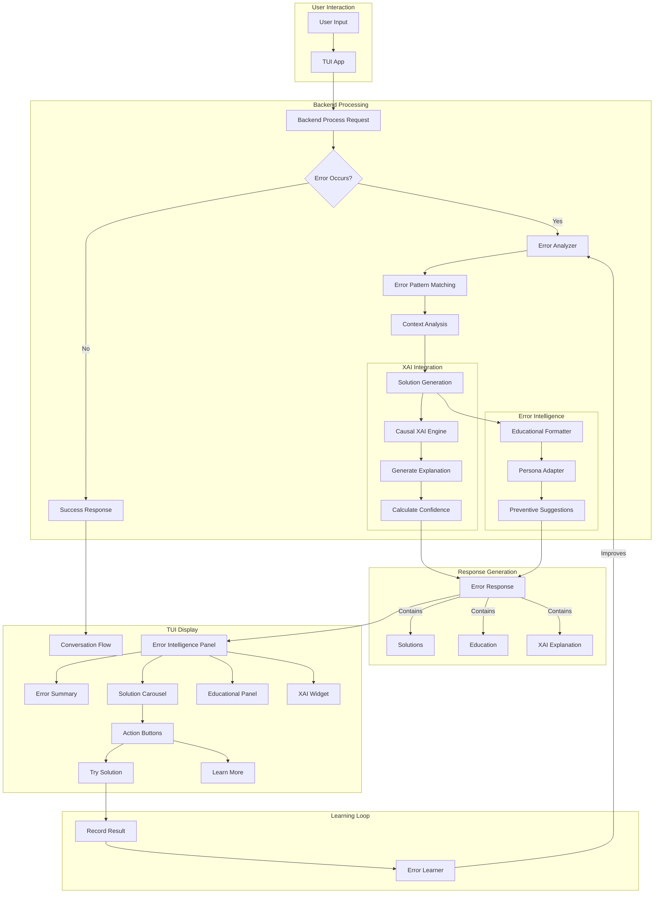

# Error Intelligence Flow Diagram

## Error Handling Flow with XAI Integration



## Component Interaction Details

### 1. Error Detection & Analysis

```
User Action → Backend Processing → Exception Thrown
                                          ↓
                                   Error Analyzer
                                          ↓
                              ┌───────────┴───────────┐
                              │                       │
                       Pattern Matching        Context Analysis
                              │                       │
                              └───────────┬───────────┘
                                          ↓
                                 Solution Generation
```

### 2. XAI Explanation Generation

```
Error Category + Context Factors + Available Solutions
                        ↓
                 Causal XAI Engine
                        ↓
            ┌───────────┴───────────┐
            │                       │
    Decision Tree            Confidence Score
            │                       │
    Why this error?          How sure are we?
            │                       │
            └───────────┬───────────┘
                        ↓
              Formatted Explanation
```

### 3. Persona-Aware Formatting

```
Raw Error Analysis + XAI Explanation
                ↓
        Educational Formatter
                ↓
         Persona Adapter
                ↓
    ┌───────────┼───────────┐
    │           │           │
Grandma Rose  Maya ADHD  Dr. Sarah
    │           │           │
  Simple      Concise    Technical
  1 solution  Fast fix   All options
  No jargon   Minimal    Full details
```

### 4. TUI Error Display Components

```
┌─────────────────────────────────────────────┐
│           Error Intelligence Panel           │
├─────────────────────────────────────────────┤
│  ❌ What went wrong:                        │
│  [Error Summary in persona language]         │
├─────────────────────────────────────────────┤
│  🤔 Why this happened:                      │
│  [XAI Explanation Widget]                    │
│  Confidence: ████████░░ 85%                 │
├─────────────────────────────────────────────┤
│  💡 Solutions:                              │
│  ┌─────────┐ ┌─────────┐ ┌─────────┐      │
│  │Solution 1│ │Solution 2│ │Solution 3│      │
│  │  [Try]   │ │  [Try]   │ │  [Try]   │      │
│  └─────────┘ └─────────┘ └─────────┘      │
├─────────────────────────────────────────────┤
│  📚 Learn More:                             │
│  • Why permissions matter in NixOS          │
│  • Best practices for package management    │
├─────────────────────────────────────────────┤
│  🛡️ Prevent this next time:                │
│  • Use declarative configuration            │
│  • Check permissions before operations      │
└─────────────────────────────────────────────┘
```

## Data Flow Examples

### Example 1: Permission Error

```yaml
1. User Input: "install docker"
2. Backend Execution: sudo required but not available
3. Error Thrown: PermissionError

4. Error Analysis:
   - Pattern: permission_denied
   - Category: PERMISSION
   - Severity: ERROR

5. Context Factors:
   - Command: nix-env -iA nixos.docker
   - User: non-root
   - System: NixOS 25.11

6. Solutions Generated:
   a. Use sudo: "sudo nix-env -iA nixos.docker"
   b. Declarative: Add to configuration.nix
   c. User install: "nix-env -iA nixpkgs.docker"

7. XAI Explanation:
   "I couldn't install docker because system-wide installation
   requires administrator privileges. This is a security feature
   of NixOS to prevent unauthorized system changes."

8. Persona Formatting (Grandma Rose):
   "Oh dear, I need special permission to install Docker for you.
   It's like needing a key to open a locked door. Would you like
   me to show you how to get that permission?"
```

### Example 2: Package Not Found

```yaml
1. User Input: "install fierfix" (typo)
2. Backend Execution: Package lookup fails
3. Error Thrown: PackageNotFoundError

4. Error Analysis:
   - Pattern: package_not_found
   - Category: NOT_FOUND
   - Severity: ERROR

5. Context Factors:
   - Requested: fierfix
   - Similar: firefox (edit distance: 2)
   - Confidence: 0.9 (high similarity)

6. Solutions Generated:
   a. Typo correction: "Did you mean 'firefox'?"
   b. Search: "nix search nixpkgs browser"
   c. List similar: Show packages with similar names

7. XAI Explanation:
   "I couldn't find 'fierfix' because it doesn't exist in nixpkgs.
   Based on the spelling similarity (92% match), you likely meant
   'firefox', which is available."

8. Persona Formatting (Maya ADHD):
   "Can't find 'fierfix'. Did you mean firefox?
   [Yes, install firefox] [No, search browsers]"
```

## Integration Points Summary

| Component | Current Location | Integration Method |
|-----------|-----------------|-------------------|
| Error Detection | backend.py:169-187 | Wrap in try/catch with analyzer |
| Error Analysis | New: ErrorAnalyzer | Called on exception |
| XAI Integration | xai/causal_engine.py | Explain error diagnosis |
| UI Display | app.py:319-327 | Replace with ErrorIntelligencePanel |
| Learning | New: ErrorLearner | Record solution outcomes |

## Benefits of Integration

1. **Educational Value**: Every error teaches something
2. **Reduced Frustration**: Clear solutions instead of cryptic messages
3. **Preventive Learning**: Avoid repeat errors
4. **Trust Building**: Transparent AI reasoning
5. **Persona Optimization**: Right level of detail for each user

---

*"In the flow of error intelligence, every exception becomes an opportunity for growth."*
