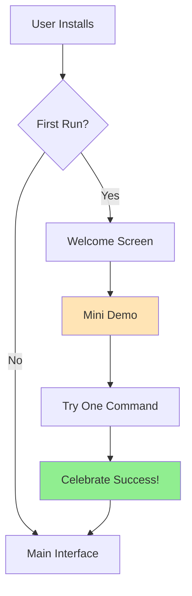
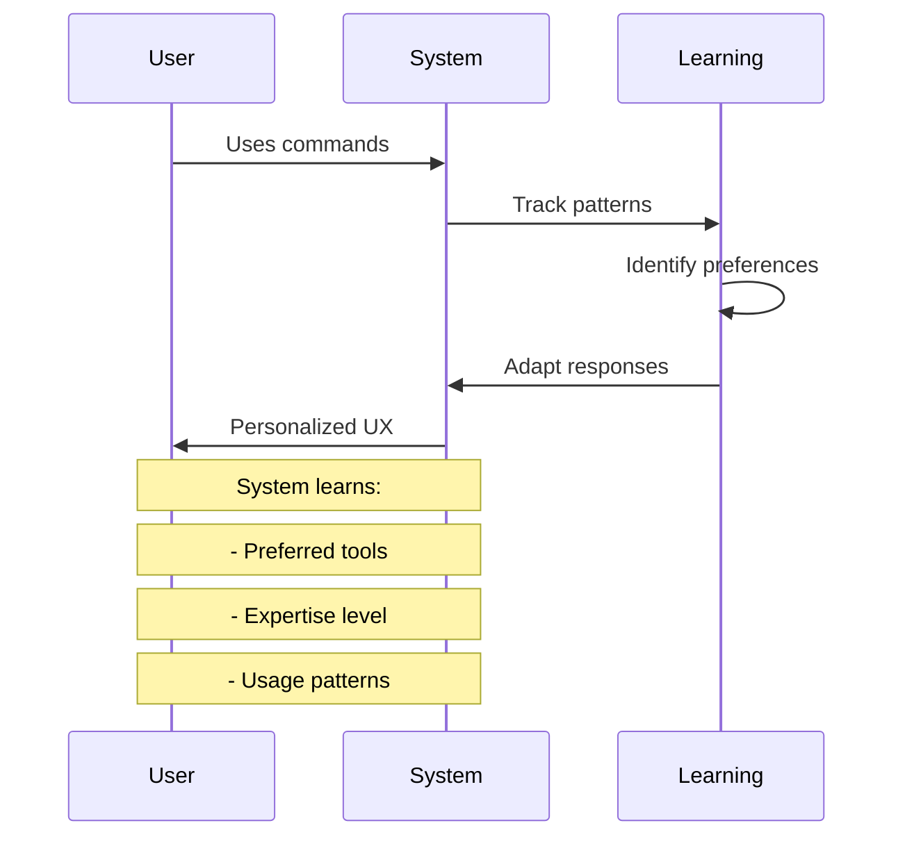

# 🚀 Interactive Onboarding Flow - Nix for Humanity

## 🎯 Progressive Onboarding Journey

### Stage 1: First Contact (0-5 minutes)
**Goal**: Instant success and delight



#### Welcome Script
```python
def first_run_experience():
    """Progressive disclosure at its finest."""

    print("""
    🌟 Welcome to Nix for Humanity!

    I'll help you use NixOS with natural language.
    No need to memorize commands - just tell me what you need!

    Let's start with something simple:
    """)

    # Guided first command
    suggestion = random.choice([
        "Try: 'install firefox'",
        "Try: 'search text editor'",
        "Try: 'what is nix?'"
    ])

    print(f"💡 {suggestion}")
```

### Stage 2: Building Confidence (5-30 minutes)
**Goal**: Teach core concepts through doing

```yaml
Progressive Tasks:
  Level 1 - Basics:
    - Install a package
    - Search for software
    - Get help on a topic

  Level 2 - Exploration:
    - Install multiple packages
    - Discover similar software
    - View package details

  Level 3 - Configuration:
    - Generate simple config
    - Preview changes
    - Apply configuration
```

#### Interactive Tutorial Mode
```bash
$ ask-nix --tutorial

🎓 Interactive Tutorial Mode

Lesson 1: Installing Software
────────────────────────────
Instead of memorizing "nix-env -iA nixpkgs.firefox",
just say what you want!

Try it now: Type "install a web browser"

> install a web browser

Great! I found several browsers. Here's how I understood you:
- "install" → You want to add software
- "web browser" → Category search

[Shows results with explanations]

✅ Lesson complete! You've learned:
- Natural language works
- Categories are searchable
- Multiple options exist

Next lesson? [Y/n]
```

### Stage 3: Personalization (30+ minutes)
**Goal**: System adapts to user's style



## 🎨 Visual Onboarding Elements

### 1. Progress Indicators
```
Your Nix Journey: 🌱──────🌿──────🌳──────🌟
                  ^
                  You are here (Beginner)

Skills Unlocked:
✅ Basic installation
✅ Package search
🔒 Configuration (Next!)
🔒 Advanced features
```

### 2. Achievement System
```python
achievements = {
    "first_install": {
        "title": "First Steps! 👟",
        "desc": "Installed your first package"
    },
    "search_master": {
        "title": "Search Ninja 🔍",
        "desc": "Used 5 different search queries"
    },
    "config_wizard": {
        "title": "Configuration Wizard 🧙",
        "desc": "Generated your first config"
    }
}
```

### 3. Contextual Tips
```bash
$ ask-nix "install firefox"

# After successful install:
💡 Pro tip: You can also say "install my usual browser"
   and I'll remember Firefox is your preference!

# Based on user level:
Beginner: "Great job! Try 'firefox --help' to see options"
Intermediate: "Config location: ~/.mozilla/firefox/"
Advanced: "Profile management: firefox -P"
```

## 🔄 Adaptive Complexity

### Beginner Mode (Default)
```bash
$ ask-nix "install git"

Installing Git version control...
✅ Success! Use 'git' to start

New to Git? Try:
- git init (start a project)
- git clone <url> (copy a project)
```

### Intermediate Mode (Auto-detected)
```bash
$ ask-nix "install git"

Installing git-2.42.0...
✅ Installed to /nix/store/abc123...

Added commands: git, git-upload-pack, git-receive-pack
Config: ~/.gitconfig
```

### Expert Mode (Power user)
```bash
$ ask-nix "install git"

nix-env -iA nixpkgs.git
/nix/store/h4h5...git-2.42.0
Dependencies: perl, curl, openssh
Build time: 0.3s (cached)
```

## 🎮 Interactive Elements

### 1. Command Playground
```
🎮 Command Playground - Risk-free experimentation!

Try these safely:
□ "install firefox but don't actually do it"
□ "show me what would happen if I installed vim"
□ "preview updating my system"

All commands run in dry-run mode here!
```

### 2. Scenario-Based Learning
```
📚 Common Scenarios:

1. "I'm a web developer" →
   - Installs: nodejs, npm, git, vscode
   - Configures: Development environment

2. "I'm switching from Ubuntu" →
   - Maps familiar commands
   - Shows equivalent packages

3. "I need a secure system" →
   - Hardening recommendations
   - Security tools
```

### 3. Interactive Configuration Builder
```yaml
🔧 Configuration Assistant

What would you like to configure?
1. [x] Enable firewall
2. [ ] Set up printer
3. [x] Configure audio
4. [ ] Add user

Generating configuration...

networking.firewall.enable = true;
sound.enable = true;
hardware.pulseaudio.enable = true;

Preview in your editor? [Y/n]
```

## 📊 Onboarding Metrics

Track user progress:
- Time to first successful command
- Commands tried before success
- Features discovered
- Help accessed
- Confidence progression

```python
def track_onboarding_health():
    metrics = {
        "first_success_time": "45 seconds",  # Target: <1 min
        "discovery_rate": "3 features/session",  # Target: 2+
        "error_recovery": "95%",  # Target: >90%
        "return_rate": "89%"  # Target: >80%
    }
    return optimize_based_on(metrics)
```

## 🌟 Delightful Moments

### Celebration Animations
```
First install:  🎉 Congratulations on your first install!
5th install:    🚀 You're on a roll! 5 packages and counting!
10th install:   🏆 Power user achievement unlocked!
Config created: 🎨 Beautiful! Your first configuration!
```

### Encouraging Messages
```python
encouragements = [
    "You're learning fast! 🌟",
    "That was perfect! ✨",
    "You're a natural at this! 🎯",
    "NixOS mastery +1! 📈",
    "Exactly right! You've got this! 💪"
]
```

### Easter Eggs
```bash
$ ask-nix "make me happy"
🌈 Installing joy... Just kidding!
Here's a fortune cookie: [random uplifting quote]

$ ask-nix "i love nix"
💙 Nix loves you too! Here's a heart: <3
Fun fact: [interesting NixOS trivia]
```

## 🔗 Onboarding Flow Implementation

```python
class OnboardingFlow:
    def __init__(self, user_profile):
        self.stage = self.detect_stage(user_profile)
        self.personality = self.select_personality(user_profile)

    def guide_user(self, command):
        """Contextual guidance based on stage."""
        if self.stage == "first_contact":
            return self.gentle_guidance(command)
        elif self.stage == "building_confidence":
            return self.progressive_hints(command)
        else:
            return self.power_user_info(command)

    def celebrate_milestone(self, achievement):
        """Make success feel amazing."""
        animation = self.get_celebration_animation(achievement)
        message = self.get_encouragement(achievement)
        next_goal = self.suggest_next_challenge(achievement)

        return {
            "animation": animation,
            "message": message,
            "next": next_goal
        }
```

## 📚 Resources for Each Stage

### Beginners
- Quick reference card (printable)
- Video tutorials (2-3 min each)
- Common tasks cheatsheet
- FAQ for switchers

### Intermediate
- Architecture overview
- Configuration examples
- Troubleshooting guide
- Community resources

### Advanced
- API documentation
- Extension development
- Performance tuning
- Contributing guide

---

## ✨ The Magic Formula

```
Instant Success + Progressive Learning + Personal Adaptation = Mastery
```

Every user should feel:
1. **Capable** from the first command
2. **Curious** to explore more
3. **Confident** in their growing skills
4. **Connected** to the community

---

*Remember: The best onboarding is invisible - users just feel naturally successful!*
