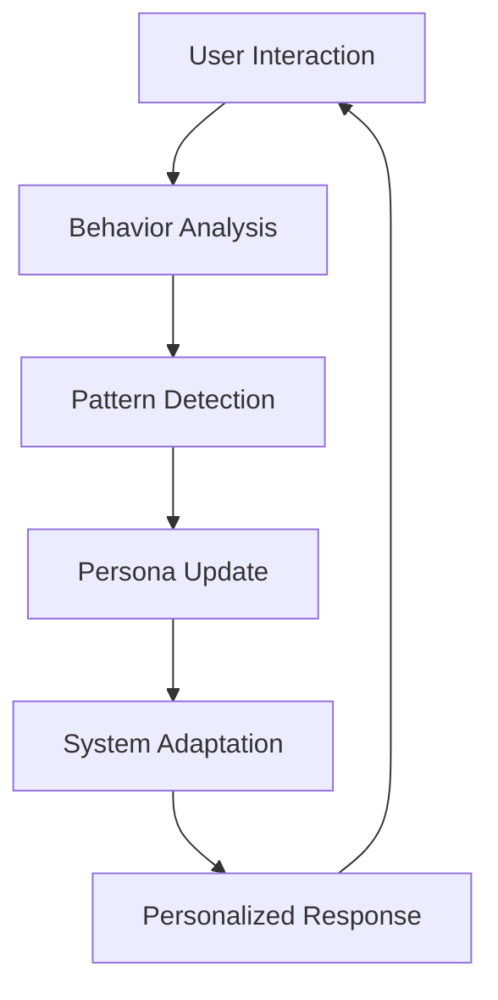

# 🌟 Adaptive Features Guide - The "Persona of One" Revolution

> *"Technology that learns you, grows with you, and becomes uniquely yours"*

## 📖 Table of Contents
- [Overview](#overview)
- [The Five Adaptive Systems](#the-five-adaptive-systems)
- [How It Works](#how-it-works)
- [Configuration](#configuration)
- [Examples](#examples)
- [Technical Architecture](#technical-architecture)
- [Privacy & Ethics](#privacy--ethics)

## Overview

Luminous Nix introduces revolutionary adaptive features that create a **"Persona of One"** - a unique, evolving profile for each user. Instead of forcing users into predefined categories, the system learns and adapts to each individual's:

- Technical proficiency
- Learning style
- Emotional patterns
- Preferred communication style
- Growth trajectory

This creates technology that truly serves consciousness by meeting each person exactly where they are.

## The Five Adaptive Systems

### 1. 🎭 Dynamic Persona Learning

The core of our adaptive system - each user becomes their own unique persona.

**Key Features:**
- Learns from every interaction
- Tracks technical proficiency (0.0 to 1.0)
- Monitors emotional states
- Adapts verbosity preferences
- Remembers learning patterns

**How it adapts:**
```python
# Example: System detecting user needs
User makes typo → System notes patience level
User uses advanced command → Updates technical proficiency
User asks for help → Increases verbosity preference
User succeeds after struggle → Boosts confidence tracking
```

### 2. 🎵 Adaptive Voice System

Voice output that changes tone based on emotional context.

**Seven Voice Tones:**
- **CALM** - Soothing for stressed users
- **ENCOURAGING** - Supportive during learning
- **EFFICIENT** - Quick for rushed situations
- **PATIENT** - Slow and clear for beginners
- **CELEBRATORY** - Joyful for successes
- **GENTLE** - Soft for frustrated users
- **FOCUSED** - Clear for complex tasks

**Example Adaptations:**
```
Frustrated user + error → GENTLE tone + slower speech
Confident user + success → CELEBRATORY tone + normal speed
Rushed user + command → EFFICIENT tone + faster speech
Learning user + new concept → PATIENT tone + clear enunciation
```

### 3. 🎨 UI Complexity Adjustment

Interface that progressively reveals features as users gain expertise.

**Five Complexity Levels:**

| Level | Description | Features Shown | Font Size | Max Options |
|-------|-------------|----------------|-----------|-------------|
| MINIMAL | Just essentials | 20% | 18px | 5 |
| SIMPLE | Basic features | 40% | 16px | 7 |
| STANDARD | Common features | 60% | 14px | 10 |
| ADVANCED | Power features | 80% | 13px | 15 |
| EXPERT | Everything | 100% | 12px | 50 |

**Progressive Reveal Example:**
```
New user sees:
[Install] [Search] [Help]

Expert user sees:
[Install] [Search] [Build] [Flakes] [Overlays] [Rollback] [GC] [REPL] ...
```

### 4. 🛡️ Proactive Error Prevention

Prevents errors before they occur by learning from patterns.

**Eight Error Categories Prevented:**
1. **TYPO** - Common misspellings (e.g., "nix-enc" → "nix-env")
2. **PERMISSION** - Missing sudo detection
3. **DEPENDENCY** - Missing prerequisites
4. **SYNTAX** - Command structure issues
5. **STATE** - System state conflicts
6. **RESOURCE** - Low disk space warnings
7. **COMPATIBILITY** - Version mismatches
8. **DANGEROUS** - Destructive operations

**Example Prevention:**
```bash
User types: nixos-rebuild switch
System warns: ⚠️ This needs 'sudo' - shall I add it?

User types: rm -rf /etc/nixos
System warns: 🔴 CRITICAL: This could destroy your system! Are you sure?

User types: nix-enc -iA nixpkgs.firefox
System suggests: Did you mean 'nix-env'? [Y/n]
```

### 5. 📚 Personalized Learning Paths

Adaptive learning journeys through NixOS based on skill level.

**Learning Adaptation:**
- Assesses current skill level
- Creates personalized objectives
- Tracks progress and success rates
- Adjusts pace based on learning speed
- Provides context-appropriate help

**Example Learning Path:**
```
Beginner Path:
1. Install Your First Package (15 min)
2. Search for Packages (20 min)
3. Manage Generations (25 min)

Expert Path:
1. Create Custom Overlays (45 min)
2. Flake Development (90 min)
3. System Optimization (60 min)
```

## How It Works

### The Learning Loop



### Real-Time Adaptation Example

```python
# User journey over time
Interaction 1: "instal firefox"  # Typo
  → System notes: Possible beginner, makes typos
  → Adaptation: Increase error tolerance, suggest corrections

Interaction 2: "help install"  # Asks for help
  → System notes: Needs guidance, learning mode
  → Adaptation: Increase verbosity, show examples

Interaction 3: "nix flake init"  # Advanced command
  → System notes: Growing expertise, exploring
  → Adaptation: Reduce verbosity, show advanced options

Interaction 4: Successfully completes task
  → System notes: Building confidence
  → Adaptation: Celebrate success, suggest next steps
```

## Configuration

### Enabling Adaptive Features

```python
from luminous_nix.consciousness.unified_integration import UnifiedAdaptiveSystem

# Create system with all features enabled
system = UnifiedAdaptiveSystem(enable_all=True)

# Or selectively enable features
system = UnifiedAdaptiveSystem()
system.voice_system = AdaptiveVoiceSystem()  # Just voice
system.ui_system = AdaptiveUISystem()        # Just UI
```

### User Preferences

Users can override adaptive decisions:

```yaml
# ~/.config/luminous-nix/preferences.yaml
adaptive:
  voice:
    enabled: true
    auto_speak: false
    preferred_tone: calm
  
  ui:
    complexity: standard  # Lock to specific level
    allow_adaptation: true
    
  learning:
    pace: relaxed  # relaxed, normal, accelerated
    style: practical  # visual, textual, practical, conceptual
```

## Examples

### Example 1: Beginner User Journey

```python
# First interaction
User: "how install firefox"
System detects: Low technical level, needs help
Response: 
  Voice: PATIENT tone
  UI: MINIMAL complexity
  Text: "I'll help you install Firefox! Here's the simple command:
         nix-env -iA nixpkgs.firefox
         Would you like me to explain what this does?"

# After several successful installs
User: "install firefox"
System detects: Growing confidence
Response:
  Voice: EFFICIENT tone
  UI: SIMPLE complexity  
  Text: "Installing Firefox..."
```

### Example 2: Frustrated User Recovery

```python
# User having troubles
User: "why isnt this working!!!"
System detects: High frustration, multiple exclamation marks
Response:
  Voice: GENTLE tone, slower pace
  UI: Simplified view
  Text: "I see you're having trouble. Let's solve this together.
         Can you tell me what you were trying to do?"
  
# Prevents likely error
System: "I notice you might need sudo for this command.
         Shall I add it for you?"
```

### Example 3: Power User Efficiency

```python
# Experienced user
User: "nix develop --impure -c $SHELL"
System detects: Expert command usage
Response:
  Voice: FOCUSED tone (if enabled)
  UI: EXPERT complexity
  Text: "Dev shell ready."
  Shows: Advanced options, keyboard shortcuts
```

## Technical Architecture

### System Components

```
UnifiedAdaptiveSystem
├── PersonaLearningEngine
│   ├── DynamicPersona (per user)
│   ├── Interaction tracking
│   └── Learning algorithms
├── AdaptiveVoiceSystem
│   ├── Voice tone selection
│   ├── TTS integration
│   └── Emotional mapping
├── AdaptiveUISystem
│   ├── Complexity levels
│   ├── Progressive reveal
│   └── Element filtering
├── ProactiveErrorPrevention
│   ├── Pattern matching
│   ├── Error prediction
│   └── Suggestion engine
└── PersonalizedLearningSystem
    ├── Skill assessment
    ├── Path generation
    └── Progress tracking
```

### Data Flow

```python
# Unified processing pipeline
def process_command(command, user_id):
    # 1. Get or create persona
    persona = get_persona(user_id)
    
    # 2. Prevent errors proactively
    potential_errors = analyze_command(command, persona)
    if potential_errors:
        suggestion = suggest_correction(command, errors)
    
    # 3. Adapt UI complexity
    ui_config = determine_ui_level(persona)
    
    # 4. Adapt voice profile
    voice_profile = adapt_voice(persona)
    
    # 5. Guide learning
    next_objective = get_learning_objective(persona)
    
    # 6. Learn from interaction
    update_persona(persona, command, success)
    
    return personalized_response
```

## Privacy & Ethics

### Data Storage
- **All learning is local** - No data sent to external servers
- **User-controlled** - Delete your profile anytime
- **Transparent** - See exactly what the system knows about you

### Ethical Principles
1. **User Agency** - You can always override adaptations
2. **No Manipulation** - Adaptations serve you, not engagement metrics
3. **Transparent Learning** - See why the system made each decision
4. **Respectful Boundaries** - System never assumes or stereotypes

### Viewing Your Profile

```bash
# See what the system has learned about you
ask-nix profile show

# Export your data
ask-nix profile export > my-profile.json

# Reset to fresh start
ask-nix profile reset
```

## Advanced Features

### Mood-Aware Responses
The system detects and responds to emotional states:
- FRUSTRATED → Simplify and support
- CURIOUS → Provide more details
- RUSHED → Be concise
- LEARNING → Explain thoroughly
- SATISFIED → Celebrate success

### Predictive Assistance
Based on patterns, the system predicts:
- Commands you might need next
- Errors you're likely to make
- Learning objectives that fit
- Times when you're most productive

### Cross-Session Learning
The system remembers across sessions:
- Your growth trajectory
- Successful patterns
- Personal preferences
- Peak productivity times

## Troubleshooting

### System Not Adapting?
```bash
# Check if adaptation is enabled
ask-nix config get adaptive.enabled

# View current persona state
ask-nix debug persona

# Force persona update
ask-nix profile refresh
```

### Too Much/Little Adaptation?
```yaml
# Adjust adaptation sensitivity
adaptive:
  sensitivity: 0.5  # 0.0 (none) to 1.0 (maximum)
  min_interactions: 10  # Interactions before adapting
```

## The Vision

The adaptive features represent a fundamental shift in human-computer interaction:

**Traditional Software**: One-size-fits-all → You adapt to it
**Adaptive Software**: Learns preferences → Meets you halfway  
**Persona of One**: Unique evolution → Becomes truly yours

Every user's Luminous Nix becomes as unique as they are, creating technology that:
- Grows with you
- Learns from you
- Serves your consciousness
- Respects your sovereignty

---

*"Not ten personas, not a hundred - but infinite variations, one for each unique consciousness."*

## Further Reading

- [Consciousness-First Computing Philosophy](./philosophy/CONSCIOUSNESS_FIRST_COMPUTING.md)
- [Technical Implementation Details](./02-ARCHITECTURE/03-DYNAMIC-USER-MODELING.md)
- [Privacy & Sovereignty Principles](./PRIVACY_FIRST_ONBOARDING.md)

---

**Remember**: You are not a user type. You are a unique consciousness, and your technology should honor that uniqueness.

🌊 *We flow together in adaptive harmony*