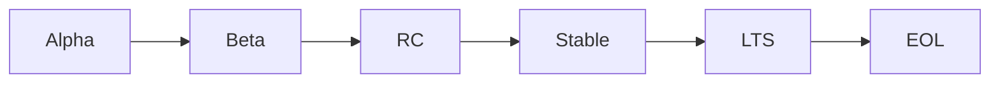

# 🔄 API Versioning Standards - Nix for Humanity

**Status**: ACTIVE
**Version**: 1.0.0
**Last Updated**: 2025-08-11
**Priority**: 🔴 HIGH - Critical for v1.0.0 stability

## 📋 Executive Summary

Nix for Humanity follows **Semantic Versioning 2.0.0** with additional guarantees for our 10 personas. Every API change is evaluated for impact on each user type.

## 🎯 Version Number Format

### Structure: `MAJOR.MINOR.PATCH`

```
1.2.3
│ │ └── PATCH: Bug fixes, no API changes
│ └──── MINOR: New features, backward compatible
└────── MAJOR: Breaking changes
```

### Examples:
- `1.0.0` → `1.0.1`: Fixed typo detection bug
- `1.0.1` → `1.1.0`: Added voice interface (new feature)
- `1.1.0` → `2.0.0`: Changed CLI argument format (breaking)

## 📊 API Surfaces & Versioning Rules

### 1. CLI Interface (`bin/ask-nix`)
**Version**: Follows package version
**Stability Promise**: v1.x.x commands will work until v2.0.0

```bash
# These MUST remain stable in v1.x.x:
ask-nix "install firefox"
ask-nix --help
ask-nix --version
ask-nix --dry-run "command"
```

**Breaking Change Examples**:
- ❌ Removing a flag
- ❌ Changing flag behavior
- ❌ Requiring new mandatory arguments

**Non-Breaking Examples**:
- ✅ Adding new optional flags
- ✅ Adding new commands
- ✅ Improving error messages

### 2. Python API (`nix_for_humanity`)
**Version**: Synchronized with package version
**Import Stability**: Public API locked at v1.0.0

```python
# These imports MUST remain stable in v1.x.x:
from nix_for_humanity import Query, Response
from nix_for_humanity.core import NixCommand
from nix_for_humanity.cli import main
```

**Public API Definition**:
- All classes/functions in `__init__.py` files
- All classes/functions without leading underscore
- All documented in API reference

**Breaking Change Examples**:
```python
# ❌ BREAKING - Changing signature
def process(query: str) -> Response:  # v1.0.0
def process(query: str, config: Config) -> Response:  # v2.0.0

# ❌ BREAKING - Removing public method
class NixCommand:
    def execute(self): ...  # Removed in v2.0.0
```

**Non-Breaking Examples**:
```python
# ✅ OK - Adding optional parameter
def process(query: str, timeout: int = 30) -> Response:

# ✅ OK - Adding new method
class NixCommand:
    def explain(self) -> str:  # New in v1.1.0
```

### 3. Configuration Files
**Version**: Independent, follows own schema version

```yaml
# ~/.config/nix-for-humanity/config.yaml
version: "1.0"  # Config schema version
settings:
  # Settings are forward-compatible
```

**Migration Policy**:
- Old configs auto-migrate on first run
- Backup created before migration
- User notified of changes

### 4. Web API (Future)
**Version**: `/api/v1/` URL prefix
**Stability**: Each version supported for 1 year minimum

```
GET  /api/v1/search?q=firefox
POST /api/v1/install
GET  /api/v1/status
```

## 🔄 Version Lifecycle

### Release Stages



1. **Alpha** (`1.2.0-alpha.1`): Internal testing only
2. **Beta** (`1.2.0-beta.1`): Public testing, API may change
3. **RC** (`1.2.0-rc.1`): Feature complete, bug fixes only
4. **Stable** (`1.2.0`): Production ready
5. **LTS** (`1.0.0-lts`): Long-term support (2 years)
6. **EOL**: End of life, security fixes only

### Support Timeline

| Version Type | Support Duration | Updates |
|-------------|-----------------|---------|
| Major (x.0.0) | 2 years | Security + critical bugs |
| Minor (1.x.0) | 6 months | Bugs only |
| Patch (1.0.x) | Until next patch | None |
| Beta/RC | 30 days | Until stable |

## 🚨 Breaking Change Process

### 1. Deprecation Warning (Minor Release)
```python
# v1.3.0 - Add deprecation warning
def old_method(self):
    warnings.warn(
        "old_method is deprecated, use new_method instead. "
        "Will be removed in v2.0.0",
        DeprecationWarning,
        stacklevel=2
    )
    return self.new_method()
```

### 2. Deprecation Period
- **Minimum**: 3 minor versions OR 6 months
- **Documentation**: Migration guide required
- **Communication**: Blog post, changelog, terminal warnings

### 3. Removal (Major Release)
```python
# v2.0.0 - Method removed
# old_method no longer exists
```

## 📝 Changelog Format

### Required Sections
```markdown
## [1.1.0] - 2025-08-11

### ✨ Added
- Voice interface for Grandma Rose persona
- Fuzzy matching for package names

### 🐛 Fixed
- Memory leak in context tracker
- Typo correction for Viktor persona

### 💥 Breaking Changes
- None (only in major versions)

### ⚠️ Deprecated
- `NixCommand.raw_execute()` - use `execute()` instead

### 🔒 Security
- Fixed command injection vulnerability

### 📊 Persona Impact
- Grandma Rose: Voice interface now available
- Viktor: Improved typo correction
```

## 🎭 Persona Impact Assessment

Every API change MUST be evaluated for impact on each persona:

```yaml
Change: Add voice interface
Impact Assessment:
  - Grandma Rose (75): ✅ HIGH POSITIVE - Primary interface
  - Maya (16, ADHD): ⚠️ NEUTRAL - Won't use, ensure not forced
  - Viktor (67, ESL): ✅ POSITIVE - Alternative to typing
  - Dr. Sarah (35): ⚠️ NEUTRAL - Prefers text
  - Alex (28, blind): ✅ HIGH POSITIVE - Accessibility improvement
  [... all 10 personas ...]
```

## 🏷️ Git Tagging Convention

```bash
# Release tags
git tag -a v1.0.0 -m "Release version 1.0.0"
git tag -a v1.1.0-beta.1 -m "Beta release 1.1.0-beta.1"

# Special tags
git tag -a v1.0.0-lts -m "Long-term support release"
git tag -a v1.0.0-eol -m "End of life marker"
```

## 📦 Package Version Sources

### Single Source of Truth: `pyproject.toml`
```toml
[tool.poetry]
version = "1.0.0"  # THE source
```

### Version Synchronization:
```python
# src/nix_for_humanity/__init__.py
__version__ = "1.0.0"  # Must match pyproject.toml

# Auto-check on import
from importlib.metadata import version
assert __version__ == version("nix-for-humanity")
```

## 🔧 Version Bumping Process

### Using Poetry:
```bash
# Patch version (1.0.0 → 1.0.1)
poetry version patch

# Minor version (1.0.1 → 1.1.0)
poetry version minor

# Major version (1.1.0 → 2.0.0)
poetry version major

# Pre-release (1.1.0 → 1.1.0-beta.1)
poetry version prerelease --next-phase
```

### Pre-commit Hook for Version Sync:
```yaml
- repo: local
  hooks:
    - id: check-version-sync
      name: Check version synchronization
      entry: python scripts/check_version_sync.py
      language: python
      files: (pyproject.toml|__init__.py)
```

## 🚀 Release Checklist

### Before ANY Release:
- [ ] Run full test suite: `poetry run pytest`
- [ ] Check persona impact assessment
- [ ] Update CHANGELOG.md
- [ ] Update documentation
- [ ] Run compliance checks: `poetry run pre-commit run --all-files`

### For Breaking Changes (Major):
- [ ] Deprecation warnings in place for 6 months
- [ ] Migration guide written
- [ ] Blog post drafted
- [ ] All 10 personas tested
- [ ] Backward compatibility layer (if possible)

### For New Features (Minor):
- [ ] Feature documented
- [ ] Tests added
- [ ] Examples provided
- [ ] Persona benefits documented

### For Bug Fixes (Patch):
- [ ] Regression test added
- [ ] Affected personas identified
- [ ] Hotfix process followed (if critical)

## 📊 API Stability Metrics

### Track These Metrics:
```python
# Backward compatibility score
breaking_changes_per_major = 0  # Target: <10
deprecated_apis_migrated = 100  # Target: 100% before removal

# API surface growth
public_api_surface = 50  # Track growth
private_to_public_ratio = 3:1  # Maintain ratio

# Version adoption
users_on_latest = 80  # Target: >80%
users_on_deprecated = 5  # Target: <10%
```

## 🔒 Security Version Policy

### Security Patches:
- Released immediately for all supported versions
- No API changes allowed
- Backported to LTS versions
- CVE number assigned if applicable

### Version Format:
```
1.0.0 → 1.0.0.post1  # Poetry post-release
1.0.0 → 1.0.1        # Standard patch
```

## 📚 Implementation Examples

### Good API Design:
```python
class NixForHumanityAPI:
    """Public API - v1.0.0 stable."""

    def __init__(self, config: Optional[Config] = None):
        """Initialize with optional config."""
        self._config = config or Config.default()

    def query(
        self,
        text: str,
        *,  # Force keyword-only args (Python 3.8+)
        timeout: int = 30,
        dry_run: bool = False,
        **kwargs  # Future expansion
    ) -> Response:
        """Process natural language query.

        Args:
            text: Natural language command
            timeout: Maximum seconds to wait
            dry_run: If True, don't execute
            **kwargs: Reserved for future use

        Returns:
            Response object with results

        Since: v1.0.0
        Stable: Yes
        """
        # Implementation
```

### Version Detection:
```python
def check_api_version():
    """Check if API version is compatible."""
    from importlib.metadata import version

    current = version("nix-for-humanity")
    major, minor, patch = current.split(".")

    if int(major) < 1:
        raise RuntimeError("Beta version not supported")

    if int(major) > 1:
        warnings.warn("Using v2 API with v1 client")
```

## 🎉 Summary

Our API versioning ensures:
1. **Stability**: v1.x promises work until v2.0
2. **Clarity**: Semantic versioning tells the story
3. **Empathy**: Every change evaluated for persona impact
4. **Trust**: Deprecation periods respect users' time
5. **Evolution**: Room to grow without breaking

---

*"Version numbers are promises we make to our users. We keep our promises."*
