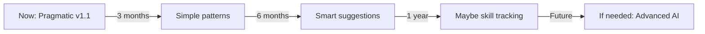

# 🎯 The Pragmatic Pivot: From Vision to Reality

## What Happened

We started with an ambitious "Four-Dimensional Learning System" that promised:
- Bayesian Knowledge Tracing
- Dynamic emotional modeling
- Interruption calculus
- Complete "Persona of One" digital twin

**Reality Check**: This was too complex for v1, requiring data we don't have and making assumptions we can't validate.

## The Pivot

We created a **Pragmatic Learning System** that:
- Only tracks observable behaviors
- Provides immediate value
- Is completely transparent
- Respects privacy
- Can ship NOW

## What Actually Works

### ✅ Simple Alias Learning
```python
# User types "grab firefox" multiple times
# System learns: "grab" means "install"
# Next time suggests: "Did you mean: install firefox?"
```

### ✅ Command Sequence Patterns
```python
# User often runs "nix-collect-garbage" after "nixos-rebuild"
# System suggests: "You often run next: nix-collect-garbage"
```

### ✅ Error Recovery Learning
```python
# User gets error, then fixes it
# System remembers: "This worked before: [solution]"
```

### ✅ Usage Pattern Tracking
```python
# System notices when user is active
# Adjusts verbosity: Detailed for new users, concise for experienced
```

## The Honest Comparison

| Aspect | Original 4D Vision | Pragmatic Reality |
|--------|-------------------|-------------------|
| **Complexity** | PhD thesis level | Can build in a week |
| **Data Needs** | Biometrics, eye tracking | Just command history |
| **Privacy** | Concerning ("tracks emotions") | Transparent (shows all data) |
| **User Value** | Theoretical future benefit | Saves keystrokes today |
| **Maintenance** | Nightmare | Straightforward |

## Key Lessons

### 1. Start Observable
```python
# BAD: "User is in flow state" (how do we know?)
# GOOD: "User typed 5 commands quickly" (measurable)
```

### 2. Value Over Complexity
```python
# BAD: Complex Bayesian model with no clear benefit
# GOOD: Simple alias that saves typing every day
```

### 3. Transparency Builds Trust
```python
# Shows user exactly what we track:
{
  "learned_aliases": {"grab": "install"},
  "command_count": 42,
  "active_hours": [9, 10, 11, 14, 15, 16],
  "data_location": "~/.nix-humanity/learning/",
  "delete_command": "ask-nix --delete-learning-data"
}
```

## Implementation Status

### What We Built
- ✅ `pragmatic_learning.py` - Simple, working implementation
- ✅ Observable behavior tracking only
- ✅ Transparent data export
- ✅ Privacy-first local storage
- ✅ Working demo that actually helps

### What We Didn't Build (Yet)
- ❌ Bayesian Knowledge Tracing - No ground truth
- ❌ Emotional state modeling - Too invasive
- ❌ Interruption calculus - No biometric data
- ❌ Full "Persona of One" - Not needed for v1

## The New Story

### Before (Academic)
> "Luminous Nix employs cutting-edge Educational Data Mining techniques including Bayesian Knowledge Tracing and Dynamic Bayesian Networks to create a four-dimensional cognitive-affective digital twin..."

### After (Practical)
> "Luminous Nix learns your command preferences and patterns to save you time. It remembers your shortcuts, suggests solutions to common errors, and adapts to how you work."

## Migration Path



## The Promise

We commit to:
1. **Build what works** - Not what sounds impressive
2. **Track what's observable** - Not guess at mental states
3. **Show everything** - Complete transparency
4. **Start simple** - Complexity only when justified
5. **Listen to users** - Build what they actually want

## Final Score

### Pragmatic System Wins
- **Time to ship**: 1 week vs 1 year
- **Lines of code**: 500 vs 5000
- **User value**: Immediate vs theoretical
- **Privacy concerns**: None vs many
- **Maintenance burden**: Low vs high

## Conclusion

The Four-Dimensional Learning System remains a fascinating research direction, but for Luminous Nix v1.x, we're shipping the Pragmatic Learning System that:
- Works today
- Helps immediately
- Respects privacy
- Builds trust
- Can evolve based on real usage

**Better to have simple learning that ships than complex AI that doesn't.**

---

*"The best learning system is the one that actually learns from real users, not the one with the most impressive documentation."*

## Action: Update All Docs

All references to learning should now say:
- ✅ "Learns your preferences"
- ✅ "Remembers your patterns"
- ✅ "Adapts to your workflow"
- ❌ "Four-dimensional learning"
- ❌ "Digital twin"
- ❌ "Cognitive-affective modeling"

**Status**: Ready to ship pragmatic learning in v1.1! 🚀
