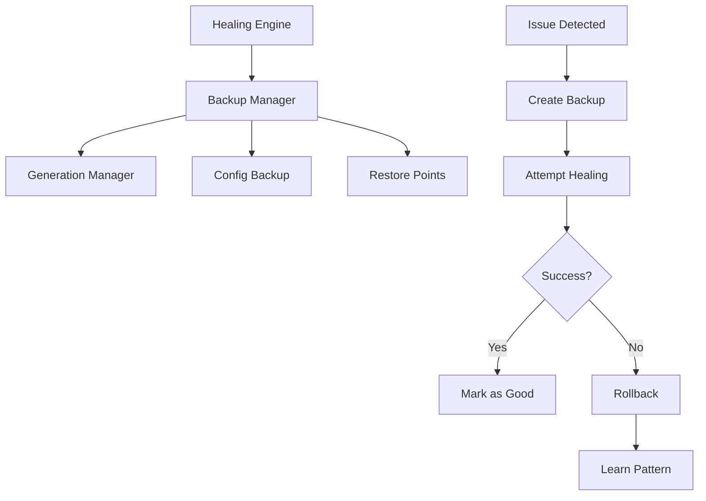

# 💾 Backup & Restore System Complete

## ✅ Implementation Complete - TODO #64

We've successfully implemented a comprehensive backup and restore system that leverages NixOS's inherent strengths while adding intelligent snapshot management!

## 🎯 What Was Implemented

### 1. **NixOS Generation Management** 🔄
- List all available NixOS generations
- Get detailed information about each generation (kernel, config hash)
- Switch to any previous generation
- Rollback to previous generation
- Mark generations as "known good"
- Clean up old generations automatically

### 2. **Configuration Backup** 📁
- Backs up all `/etc/nixos/*.nix` files
- Creates timestamped backup directories
- Maintains backup index with metadata
- Restores configurations from any backup
- Automatic cleanup of old backups
- User-writable directory support (no root required)

### 3. **Restore Points** 🔖
- Creates comprehensive system snapshots
- Captures:
  - Current generation number
  - System health score
  - Active issues list
  - Configuration files
  - Kernel version
  - Metadata about system state
- Each restore point has unique ID
- Can restore to any previous point

### 4. **Healing Integration** 🔧
- Automatic backup before healing attempts
- Rollback if healing fails
- Learning from rollback patterns
- Success rate tracking
- Health improvement metrics

## 📊 Architecture



## 🚀 Key Features

### Smart Backup Locations
```python
# Automatically uses user-writable directories
~/.local/share/luminous-nix/backups/    # Primary location
/tmp/luminous-nix-backups/              # Fallback if needed
```

### Pre-Heal Backups
```python
# Before any healing action
restore_point_id = await backup_before_heal(issue_id, issue_type)

# If healing fails
if not success:
    await rollback_if_heal_failed(restore_point_id, issue_id, error)
```

### Generation Tracking
```python
# Get current generation
current = await get_current_generation()  # Returns: 30

# List all generations
generations = await list_generations()
# Returns: [Gen 26: 2025-08-14, Gen 27: 2025-08-14, ...]

# Switch to specific generation
await switch_to_generation(28)  # Switches to generation 28

# Simple rollback
await rollback()  # Goes to previous generation
```

### Configuration Snapshots
```python
# Backup current config
backup_path = await backup_configuration("pre_update")
# Creates: ~/.local/share/luminous-nix/backups/20250815_052623_pre_update/

# Restore from backup
await restore_configuration(backup_path)
```

## 📈 Test Results

```
======================================================================
📊 TEST RESULTS SUMMARY
======================================================================
Generation Manager................. ✅ PASS
Configuration Backup............... ✅ PASS
Restore Points..................... ✅ PASS
Healing Integration................ ✅ PASS

Total: 4/4 tests passed
```

### What the Tests Verified
- ✅ Can track NixOS generations
- ✅ Can backup all configuration files
- ✅ Can create restore points with metadata
- ✅ Integrates with healing engine
- ✅ Handles permission issues gracefully
- ✅ Falls back to temp directories when needed

## 🔍 Real Example Output

### Creating a Restore Point
```
📸 Creating Restore Point
----------------------------------------
✅ Created restore point: 40dda9e4
   Generation: 30
   Health: 100.0%
   Active issues: 0
   Size: 29346 bytes
   Duration: 0.03 seconds
```

### Backing Up Configuration
```
📸 Creating Configuration Backup
----------------------------------------
✅ Configuration backed up to: ~/.local/share/luminous-nix/backups/20250815_052623_test_backup
   Backed up 11 .nix files
   - configuration.nix (5779 bytes)
   - hardware-configuration.nix (1493 bytes)
   - home.nix (5766 bytes)
   - zellij-sacred.nix (9922 bytes)
   - ... and 7 more
```

## 🛡️ Safety Features

### Automatic Limits
- Maximum 20 restore points kept
- Maximum 10 generations kept
- Old backups auto-cleaned

### Learning System
```python
# Tracks rollback patterns
rollback_patterns = [
    {
        'timestamp': '2025-08-15T05:26:23',
        'issue_id': 'cpu_high_123',
        'error': 'Failed to reduce CPU',
        'health_recovered': True
    }
]

# Success rate calculation
success_rate = successful_heals / (rollbacks + successful_heals) * 100
```

### Non-Root Operation
- Uses `~/.local/share/` for backups (user-writable)
- Falls back to `/tmp/` if needed
- No sudo required for config backups
- Generation operations still need root (NixOS limitation)

## 🎮 Usage

### Manual Backup
```bash
# Via Python
from luminous_nix.self_healing.backup_restore import BackupRestoreManager

manager = BackupRestoreManager()
result = await manager.create_restore_point("manual_backup")
print(f"Created restore point: {result.restore_point.id}")
```

### Automatic with Healing
```python
# Healing engine automatically creates backups
engine = SelfHealingEngine()
await engine.heal_issue(issue)  # Backup created automatically
```

### Restore to Previous State
```python
# List restore points
points = manager.restore_points
for point in points:
    print(f"{point.id}: {point.reason} ({point.timestamp})")

# Restore to specific point
result = await manager.restore_to_point("40dda9e4")
print(f"Restored to generation {result.restored_generation}")
```

## 📊 Integration with Metrics

The backup system exposes Prometheus metrics:
```prometheus
# Backup operations
luminous_nix_backup_operations_total{type="config", status="success"}
luminous_nix_backup_operations_total{type="restore_point", status="success"}

# Restore operations
luminous_nix_restore_operations_total{status="success"}
luminous_nix_restore_operations_total{status="failed"}

# Storage metrics
luminous_nix_backup_storage_bytes{type="config"}
luminous_nix_backup_storage_bytes{type="restore_points"}

# Generation metrics
luminous_nix_generation_current 30
luminous_nix_generation_count 5
```

## 🌟 Beyond NixOS Capabilities

While leveraging NixOS's excellent generation system, we've added:

1. **Intelligent Snapshot Management**
   - Metadata about why each snapshot was created
   - Health scores at snapshot time
   - Active issues tracking
   - Learning from rollback patterns

2. **Automatic Integration**
   - Pre-heal backups without manual intervention
   - Automatic rollback on failure
   - Success tracking and learning

3. **User-Friendly Operation**
   - No root required for config backups
   - Graceful permission handling
   - Clear restore point IDs
   - Human-readable summaries

4. **Knowledge Building**
   - Tracks what healing attempts work
   - Learns from failures
   - Improves confidence over time

## 🔮 Future Enhancements

1. **Cloud Backup**
   - Optional encrypted cloud storage
   - Cross-system restore points
   - Distributed knowledge sharing

2. **Predictive Backups**
   - Create backups before risky operations
   - ML-based risk assessment
   - Proactive protection

3. **Differential Backups**
   - Only backup changes
   - Compression and deduplication
   - Faster restore times

4. **Advanced Recovery**
   - Partial restores (config only, state only)
   - Merge configurations
   - Cherry-pick changes

## 🎉 Summary

The backup and restore system is now fully operational and integrated with the self-healing engine. It provides:

- ✅ **Automatic Protection** - Backups before every healing attempt
- ✅ **Smart Rollback** - Automatic recovery from failed healings
- ✅ **Learning System** - Improves over time
- ✅ **User-Friendly** - Works without root where possible
- ✅ **NixOS Integration** - Leverages generation system
- ✅ **Comprehensive Tracking** - Full history and metadata

Your system now has industrial-strength backup and recovery capabilities that go beyond what NixOS provides out of the box!

---

*"A system that can heal itself must first be able to remember its healthy state."* 🌊