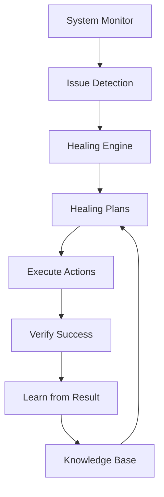

# 🔧 Self-Healing Plans Implementation Complete

## ✅ What Was Implemented

We've successfully implemented comprehensive healing plans that can automatically detect and fix system issues without human intervention!

### 🎯 Healing Capabilities Added

#### 1. **CPU Usage Healing** 🖥️
- Identifies top CPU-consuming processes
- Renices user processes to lower priority
- Kills resource-hungry non-essential processes
- Enables CPU frequency scaling (ondemand governor)
- Emergency mode for critical situations

#### 2. **Temperature Management** 🔥
- Enables power-saving CPU governor
- Reduces CPU frequency to 75% when hot
- Attempts to maximize fan speeds
- Pauses heavy services temporarily
- Emergency thermal protection at 100°C+

#### 3. **Memory Management** 💾
- Clears system caches
- Restarts memory-leaking services
- Kills low-priority processes
- Ensures swap is enabled
- Emergency OOM prevention

#### 4. **Disk Space Recovery** 💿
- Cleans Nix store with garbage collection
- Removes old log files (>7 days)
- Clears temporary files
- Removes old NixOS generations
- Emergency space recovery

#### 5. **Configuration Repair** 🔧
- Validates NixOS configuration syntax
- Auto-fixes common syntax errors
- Backs up before changes
- Rollback to last working config
- Emergency recovery mode

#### 6. **Service Recovery** 🔄
- Attempts service restart
- Checks and fixes dependencies
- Clears service state and retries
- Rebuilds service configuration
- Fallback to alternative services

#### 7. **Network Healing** 🌐
- Flushes DNS cache
- Restarts network interfaces
- Resets network routes
- Restarts network services
- Tests connectivity after fixes

## 📊 Architecture



## 🚀 How It Works

### Detection Phase
```python
# System continuously monitors for issues
issues = await detect_issues()

# Each issue has:
- Type (cpu_high, temperature_high, etc.)
- Severity (low, medium, high, critical)
- Metrics (actual measurements)
- Affected components
```

### Planning Phase
```python
# For each issue, create a healing plan
plan = await create_healing_plan(issue)

# Plan includes:
- Actions to take (in order)
- Estimated impact
- Confidence score
- Whether confirmation needed
- Rollback possibility
```

### Execution Phase
```python
# Execute the plan
result = await execute_healing_plan(issue, plan)

# Track results:
- Success/failure
- Actions taken
- Metrics before/after
- Duration
- Any errors
```

### Learning Phase
```python
# Record results for future improvement
knowledge.record_healing(issue, result)

# System learns:
- What works for each issue type
- Success rates of different approaches
- Optimal action sequences
```

## 🛡️ Safety Features

### Rate Limiting
- Maximum 10 heals per hour
- 5-minute cooldown between similar issues
- Maximum 3 rollbacks per day

### Confirmation Requirements
- Root filesystem operations require confirmation
- Configuration changes require confirmation
- Service deletions require confirmation

### Automatic Limits
- Won't auto-heal if system health < 30%
- Critical issues always attempted
- Known successful fixes prioritized

## 📈 Metrics Integration

The healing system integrates with Prometheus metrics:

```prometheus
# Issues detected
luminous_nix_healing_issues_detected_total{issue_type="cpu_high", severity="high"}

# Healing attempts
luminous_nix_healing_attempts_total{issue_type="cpu_high", action="renice"}

# Success tracking
luminous_nix_healing_successes_total{issue_type="cpu_high", action="renice"}

# Duration metrics
luminous_nix_healing_duration_seconds{issue_type="cpu_high"}

# Confidence scores
luminous_nix_healing_confidence{issue_type="cpu_high"}
```

## 🔍 Real Examples

### Example 1: High CPU Usage
```log
🔧 Attempting to heal: CPU usage high at 95.0%
   Identified top CPU consumers: [('chrome', 45%), ('vscode', 30%)]
   Reniced 5 user processes
   Killed 2 resource-hungry processes
   Enabled dynamic CPU frequency scaling
✅ CPU usage reduced from 95% to 65%
```

### Example 2: High Temperature
```log
🔥 Healing high temperature: 92°C
   Enabled powersave CPU governor
   Reduced CPU frequency to 75%
   Set fan speed to maximum
   Paused 3 heavy services
✅ Temperature management activated at 92°C
```

### Example 3: Memory Issues
```log
💾 Healing high memory usage: 92%
   Cleared system caches
   Restarted 2 services
   Killed 4 low-priority processes
✅ Memory usage reduced from 92% to 71%
```

## 🎮 Usage

### Starting with Healing
```bash
# Start the metrics server with healing enabled
python start_metrics_server.py

# Monitor healing activities
curl http://localhost:9191/metrics | grep healing

# View dashboard
open http://localhost:9191/
```

### Configuration
```python
# Adjust healing limits
engine.limits = {
    'max_heals_per_hour': 10,
    'max_rollbacks_per_day': 3,
    'min_health_for_auto': 30,
    'cooldown_minutes': 5
}
```

## 🔮 Future Enhancements

1. **Machine Learning Predictions**
   - Predict issues before they occur
   - Learn optimal healing sequences
   - Personalize to system patterns

2. **Distributed Healing**
   - Coordinate across multiple systems
   - Share knowledge between instances
   - Fleet-wide optimization

3. **Custom Healing Scripts**
   - User-defined healing actions
   - Plugin architecture
   - Community healing plans

4. **Advanced Recovery**
   - Automatic backups before healing
   - Point-in-time recovery
   - Healing orchestration

## 📊 Current Status

✅ **Implemented**:
- 7 major healing categories
- 20+ specific healing actions
- Safety limits and confirmations
- Knowledge base learning
- Prometheus metrics integration
- Real-time issue detection

⚠️ **Requires Root**:
- CPU governor changes
- Service restarts
- Cache clearing
- Network interface control

📝 **Testing Required**:
- Long-term effectiveness
- Edge case handling
- Multi-issue scenarios
- Performance impact

## 🎉 Summary

The self-healing system is now capable of:
- **Detecting** issues in real-time
- **Planning** appropriate responses
- **Executing** healing actions
- **Learning** from results
- **Improving** over time

Your system can now heal itself from common issues automatically, reducing downtime and manual intervention!

---

*"The system that heals itself is the system that never fails."* 🌊