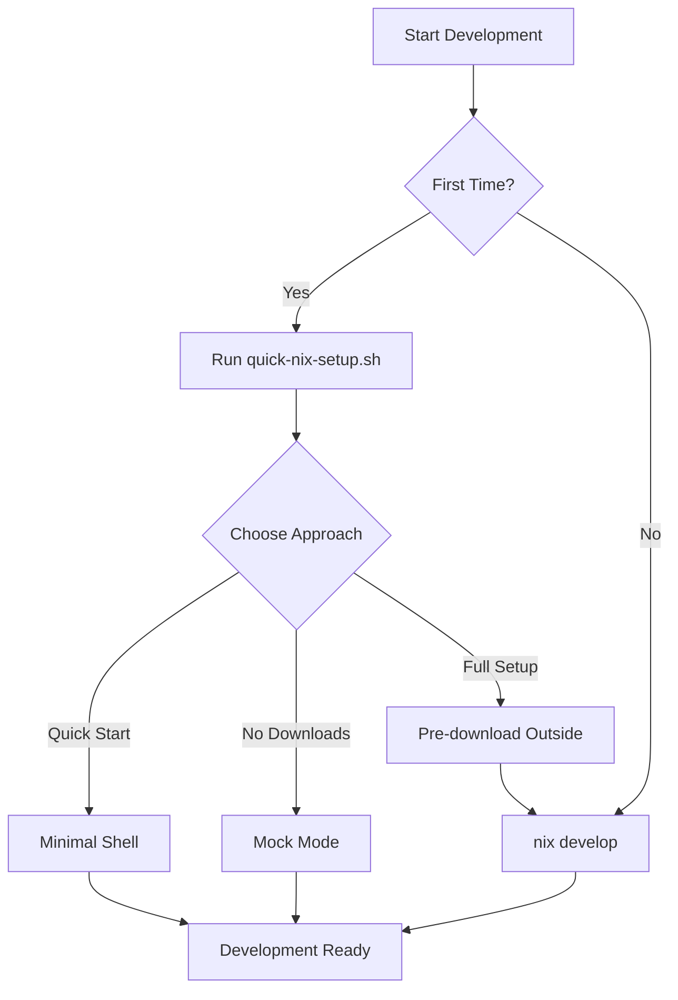

# 🌊 Graceful Download Handling for Nix for Humanity

## Problem Statement
Claude Code has a 2-minute execution timeout, but `nix develop` downloads ~2.8GB of dependencies which takes 5-10 minutes on first run. This causes timeouts and frustration.

## Solutions Implemented

### 1. Quick Setup Script (`quick-nix-setup.sh`)
An interactive menu that guides users to the best approach:
- Option 1: Minimal shell (50MB download)
- Option 2: Check if deps are cached
- Option 3: Mock mode (no downloads)
- Option 4: Full setup instructions
- Option 5: Help documentation

### 2. Minimal Voice Shell (`shell-voice-minimal.nix`)
A lightweight Nix shell that downloads only essential packages:
```nix
buildInputs = with pkgs; [
  python311
  portaudio
  espeak-ng
  sox
  ffmpeg
];
```

### 3. Mock Mode Support
Environment variables to bypass heavy dependencies:
```bash
export NIX_VOICE_MOCK=true
export NIX_HUMANITY_PYTHON_BACKEND=true
```

### 4. Binary Cache Documentation
Guide for configuring Nix binary caches to speed up downloads globally.

### 5. Progress Monitoring Script
Shows real-time download progress to understand what's happening:
```bash
./scripts/nix-with-progress.sh develop
```

## Key Insights

1. **Claude Code's timeout is unavoidable** - We must work around it, not fight it
2. **Minimal shells are the solution** - 50MB downloads work fine, 2.8GB doesn't
3. **Mock modes enable development** - You can test without full dependencies
4. **Pre-downloading works** - Run heavy downloads outside Claude Code
5. **Poetry2nix is correct** - We maintain the NO PIP principle while being practical

## Usage Flow



## Sacred Principle Maintained

✅ **NO PIP** - All solutions use pure Nix
✅ **Reproducible** - Same environment everywhere
✅ **poetry2nix** - Proper dependency management
✅ **User-friendly** - Clear options and guidance

## Next Steps for Users

1. Run `./quick-nix-setup.sh` 
2. Choose option based on your needs
3. Start developing with Nix for Humanity!

---

*"We flow with the constraints, not against them. Claude Code's timeout becomes our teacher in creating more modular, flexible development environments."* 🌊